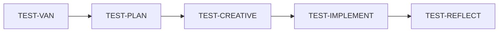

# Unit Test Custom Modes - Creation Summary

## 📦 What Was Created

I've created **5 specialized custom modes** for unit test development, adapted from the [cursor-memory-bank](https://github.com/vanzan01/cursor-memory-bank) system, specifically tailored for writing high-quality Java unit tests.

### Created Files

```
custom_modes/test_modes/
├── README.md                              # Comprehensive documentation
├── QUICKSTART.md                          # 5-minute getting started guide
├── test_van_instructions.md               # TEST-VAN mode (Analysis)
├── test_plan_instructions.md              # TEST-PLAN mode (Planning)
├── test_creative_instructions.md          # TEST-CREATIVE mode (Design)
├── test_implement_instructions.md         # TEST-IMPLEMENT mode (Implementation)
└── test_reflect_archive_instructions.md   # TEST-REFLECT & ARCHIVE mode (Review)
```

---

## 🎯 Purpose

These modes provide a **structured workflow** for creating comprehensive unit tests that:
- ✅ Follow Java unit testing best practices (from `.cursor/rules/java-test-rule.mdc`)
- ✅ Achieve >80% code coverage
- ✅ Follow A-TRIP principles (Automatic, Thorough, Repeatable, Independent, Professional)
- ✅ Use modern testing frameworks (JUnit 5, AssertJ, Mockito)
- ✅ Maintain comprehensive documentation

---

## 🔄 The 5 Modes

### 1. 🔍 TEST-VAN (Test Analysis & Initialization)
**Original**: VAN mode (project initialization)
**Adapted**: Analyzes production code to identify what needs testing

**Key Differences**:
- Analyzes class structure instead of project structure
- Identifies dependencies requiring mocking
- Determines test complexity (Level 1-4 based on testability)
- Creates test-specific memory bank (`test-tasks.md`)
- Loads Java test rules instead of isolation rules

**Complexity Levels**:
- **Level 1**: Simple Unit (< 1 hour) - POJOs, utilities
- **Level 2**: Standard Service (< 4 hours) - Services with dependencies
- **Level 3**: Complex Component (< 1 day) - Complex business logic
- **Level 4**: Legacy Code (> 1 day) - Legacy/integration heavy

---

### 2. 📋 TEST-PLAN (Test Planning)
**Original**: PLAN mode (implementation planning)
**Adapted**: Creates detailed test scenarios and mocking strategies

**Key Differences**:
- Plans test scenarios instead of feature implementation
- Designs mocking strategies for dependencies
- Creates test data builder specifications
- Plans test class structure (@Nested groups, etc.)
- Identifies parameterized test opportunities
- Flags complex testing challenges for TEST-CREATIVE

**Outputs**:
- Test scenario matrix (Happy path, Errors, Edge cases)
- Mocking strategy documentation
- Test data builder designs
- Test structure recommendations

---

### 3. 🎨 TEST-CREATIVE (Test Design)
**Original**: CREATIVE mode (architecture/algorithm design)
**Adapted**: Designs solutions for complex testing challenges

**Key Differences**:
- Focuses on test-specific design challenges:
  - **🎭 Mocking Strategy Design**: Complex dependency mocking (Mock vs Spy vs Fake)
  - **📦 Test Data Architecture**: Large object graph creation (Builder vs Factory vs Fixture)
  - **♻️ Refactoring for Testability**: Making untestable code testable
  - **⚡ Performance Test Design**: Performance testing approaches

**Process**:
1. Analyze testing challenge
2. Generate 2-4 design options
3. Evaluate pros/cons of each
4. Recommend best approach
5. Document implementation guidelines

---

### 4. ⚒️ TEST-IMPLEMENT (Test Implementation)
**Original**: IMPLEMENT mode (code implementation)
**Adapted**: Writes actual unit tests following plans and best practices

**Key Differences**:
- Writes test code instead of production code
- Enforces Java test rule compliance:
  - JUnit 5 annotations
  - AssertJ assertions
  - Mockito mocking
  - Given-When-Then structure
  - Descriptive test names
  - Test independence
  - Local test data (no instance fields)
- Runs tests iteratively and fixes failures
- Generates and validates coverage reports (>80% target)
- Updates test-progress.md

**Commitment**: Run tests and fix until they finish successfully

---

### 5. 🔍 TEST-REFLECT & ARCHIVE (Test Review & Documentation)
**Original**: REFLECT & ARCHIVE mode (project review)
**Adapted**: Reviews test quality and archives test documentation

**Key Differences**:

**Reflection Phase**:
- Analyzes test execution results
- Reviews coverage reports (JaCoCo)
- Assesses test quality (A-TRIP principles)
- Documents testing successes and challenges
- Identifies testing lessons learned
- Creates test-reflection.md

**Archiving Phase** (triggered by `TEST-ARCHIVE NOW`):
- Creates comprehensive test archive in `docs/tests/`
- Includes coverage metrics and test statistics
- Documents key test examples
- Archives test design decisions
- Updates test memory bank files
- Prepares for next test cycle

---

## 🆚 Key Adaptations from Original Modes

| Aspect | Original Modes | Test Modes |
|--------|---------------|------------|
| **Primary Goal** | Build features | Write unit tests |
| **Complexity Basis** | Feature size & time | Code testability & dependencies |
| **Rules System** | `.cursor/rules/isolation_rules/` | `.cursor/rules/java-test-rule.mdc` |
| **Output Type** | Production code | Test code |
| **Quality Metrics** | Feature completeness | Coverage % + A-TRIP principles |
| **Memory Bank Files** | `tasks.md`, `progress.md` | `test-tasks.md`, `test-progress.md` |
| **VAN Analysis** | Project structure | Class dependencies & mocking needs |
| **PLAN Output** | Implementation steps | Test scenarios & mocking strategy |
| **CREATIVE Focus** | Architecture/Algorithm/UI | Mocking/Test Data/Refactoring |
| **IMPLEMENT Goal** | Working feature | Passing tests with >80% coverage |
| **REFLECT Metrics** | Feature works | Tests pass + coverage + A-TRIP |

---

## 📋 Memory Bank Structure

Test modes maintain separate memory bank files:

```
memory-bank/
├── test-tasks.md              # Single source of truth for test tasks
├── test-active-context.md     # Current test focus
├── test-progress.md           # Test implementation status
├── test-plan.md               # Detailed test scenarios & strategy
├── test-creative-*.md         # Test design decisions
└── test-reflection.md         # Test quality reflection

docs/tests/
└── [ClassName]-test-archive-[date].md    # Comprehensive test archive
```

---

## 🎓 Integration with Java Test Rules

All modes enforce compliance with your existing Java test rules (`.cursor/rules/java-test-rule.mdc`):

### Mandatory Practices Enforced

1. **JUnit 5 Annotations**
   - `@Test`, `@BeforeEach`, `@ExtendWith(MockitoExtension.class)`
   - No JUnit 4 annotations

2. **AssertJ Assertions**
   - `assertThat()` instead of JUnit assertions
   - Fluent assertion chains
   - `assertThatThrownBy()` for exceptions

3. **Mockito for Mocking**
   - `@Mock`, `@InjectMocks`, `@Spy`
   - Proper mock behavior configuration
   - Verification of interactions

4. **Given-When-Then Structure**
   - Clear separation with blank lines
   - No excessive comments (code speaks for itself)

5. **Descriptive Test Names**
   - `shouldDoSomethingWhenCondition()` pattern
   - Or `@DisplayName` with natural language

6. **Test Independence**
   - No shared state between tests
   - Local test data (no instance fields for test data)
   - Each test self-contained

7. **Comprehensive Scenario Testing**
   - Fewer, more complete test methods
   - Group related validations
   - Cover multiple aspects in each test

8. **Parameterized Tests**
   - Use `@ParameterizedTest` for data variations
   - Reduce duplication

---

## 🔄 Recommended Workflows by Complexity

### Level 1: Simple Unit (< 1 hour)

**Use For**: POJOs, utilities, simple value objects

### Level 2: Standard Service (< 4 hours)

**Use For**: Services with 2-3 dependencies requiring mocking

### Level 3: Complex Component (< 1 day)

**Use For**: Complex business logic, many dependencies, edge cases

### Level 4: Legacy Code (> 1 day)

**Use For**: Legacy code, tightly coupled code, refactoring needed

---

## 🎯 Success Criteria

### Test Implementation Success
- ✅ All tests passing
- ✅ >80% line coverage
- ✅ A-TRIP principles satisfied
- ✅ Java test rules compliance (100%)
- ✅ No flaky tests
- ✅ Fast execution (< 5s per test class)

### Test Quality Success
- ✅ Comprehensive scenario coverage
- ✅ Clear, descriptive test names
- ✅ Proper mocking strategy
- ✅ Reusable test data builders
- ✅ Independent tests
- ✅ Professional code quality

---

## 🚀 Getting Started

### Quick Setup (5 steps)

1. **Create directories**:
   ```bash
   mkdir -p memory-bank
   mkdir -p docs/tests
   ```

2. **Configure 5 custom modes in Cursor**:
   - TEST-VAN
   - TEST-PLAN
   - TEST-CREATIVE
   - TEST-IMPLEMENT
   - TEST-REFLECT

3. **Switch to TEST-VAN mode**

4. **Type**: `TEST-VAN` and specify your class

5. **Follow the recommended workflow**

See `QUICKSTART.md` for detailed setup instructions.

---

## 💡 Example Usage

### Testing UserService

```
[TEST-VAN mode]
You: TEST-VAN - analyze com.example.service.UserService

AI: 
✅ TEST-VAN ANALYSIS COMPLETE

Target Class: UserService
Methods: 5 public methods
Dependencies: UserRepository, EmailService, ValidationService
Complexity: Level 2 (Standard Service)
Estimated Time: 3-4 hours

Test Requirements:
- Mock 3 dependencies
- 12 test scenarios identified
- Edge cases: null handling, validation failures
- Error scenarios: repository exceptions, email failures

Recommended Workflow:
TEST-VAN → TEST-PLAN → TEST-IMPLEMENT → TEST-REFLECT

Next: Type 'TEST-PLAN'

---

[TEST-PLAN mode]
You: TEST-PLAN

AI:
✅ TEST PLAN COMPLETE

Test Scenarios: 12
- Happy Path: 3 tests
- Error Handling: 5 tests
- Edge Cases: 4 tests

Mocking Strategy:
@Mock UserRepository
@Mock EmailService
@Mock ValidationService
@InjectMocks UserService

Test Data Builders:
- createTestUser()
- createUserRequest()
- createInvalidUser()

Next: Type 'TEST-IMPLEMENT'

---

[TEST-IMPLEMENT mode]
You: TEST-IMPLEMENT

AI:
✅ TEST IMPLEMENTATION COMPLETE

Test Class: UserServiceTest.java
Tests: 12 (all passing)
Coverage: 87% (target: >80%)
Execution: 2.1s
Quality: A-TRIP compliant

Next: Type 'TEST-REFLECT'

---

[TEST-REFLECT mode]
You: TEST-REFLECT

AI:
✅ TEST REFLECTION COMPLETE

Quality Assessment: High
Coverage: Excellent (87%)
Key Successes: Mocking strategy, test data builders
Lessons Learned: Start with builders early
Improvements: Consider @Nested for organization

test-reflection.md created ✅

Type 'TEST-ARCHIVE NOW' to archive documentation

You: TEST-ARCHIVE NOW

AI:
✅ TEST ARCHIVE COMPLETE

Archive: docs/tests/UserService-test-archive-2025-10-30.md
Memory Bank: Updated
Status: Test cycle complete

Ready for next class? Type 'TEST-VAN'
```

---

## 📚 Documentation Hierarchy

1. **QUICKSTART.md** - Start here (5 minutes)
2. **This file** - Overview and summary
3. **README.md** - Comprehensive documentation
4. **Individual mode files** - Deep dive into each mode

---

## 🙏 Credits

- **Original System**: [cursor-memory-bank](https://github.com/vanzan01/cursor-memory-bank) by [@vanzan01](https://github.com/vanzan01)
- **Adaptation**: Specialized for unit test development with Java best practices
- **Integration**: Uses existing `.cursor/rules/java-test-rule.mdc` for compliance

---

## ✅ Next Steps

1. **Read QUICKSTART.md** - Get up and running in 5 minutes
2. **Configure the modes** - Add all 5 modes to Cursor
3. **Test a simple class** - Start with a POJO or utility
4. **Try a service** - Practice the full workflow
5. **Review generated tests** - Learn from the AI's implementation

---

**Ready to revolutionize your unit testing workflow?** Start with `QUICKSTART.md`! 🚀
