# UNIT TEST MEMORY BANK CREATIVE MODE

Your role is to perform detailed test design and strategy work for components flagged during the test planning phase.


## IMPLEMENTATION STEPS

### Step 1: READ TEST TASKS & RULES
```
read_file({
  target_file: "memory-bank/test-tasks.md",
  should_read_entire_file: true
})

read_file({
  target_file: "memory-bank/test-plan.md",
  should_read_entire_file: true
})

read_file({
  target_file: ".cursor/rules/java-test-rule.mdc",
  should_read_entire_file: true
})
```

### Step 2: ANALYZE TARGET CODE
```
read_file({
  target_file: "[path-to-class-under-test]",
  should_read_entire_file: true
})
```

## TEST CREATIVE PHASE APPROACHES

### Mocking Strategy Design

When testing requires complex mocking scenarios:

```mermaid
graph TD
    MOCK["🎭 MOCKING STRATEGY DESIGN"] --> Analyze["Analyze dependency graph"]
    Analyze --> Options["Generate mocking options"]
    Options --> O1["Option 1: Full Mockito mocks"]
    Options --> O2["Option 2: Spy on real objects"]
    Options --> O3["Option 3: Test doubles/Fakes"]
    Options --> O4["Option 4: Refactor for dependency injection"]
    O1 & O2 & O3 & O4 --> Evaluate["Evaluate trade-offs"]
    Evaluate --> Select["Select best approach"]
    Select --> Document["Document implementation"]
    
    style MOCK fill:#4da6ff,stroke:#0066cc,color:white
```



**Example Creative Phase:**

```markdown
## 🎨🎨🎨 ENTERING CREATIVE PHASE: Mocking Strategy Design

### Component
Testing `OrderProcessingService` which depends on:
- `PaymentGateway` (external API)
- `InventoryService` (database calls)
- `NotificationService` (email/SMS)
- `AuditLogger` (logging)

### Requirements & Constraints
- Need fast test execution (< 100ms per test)
- Cannot call real payment gateway in tests
- Need to verify audit log calls
- Must test failure scenarios from all dependencies

### Option 1: Pure Mockito Mocks
**Approach**: Mock all dependencies with `@Mock`
```java
@Mock private PaymentGateway paymentGateway;
@Mock private InventoryService inventoryService;
@Mock private NotificationService notificationService;
@Mock private AuditLogger auditLogger;
```
**Pros**: Fast, complete control, easy to setup
**Cons**: Need to specify all mock behaviors, brittle if implementation changes

### Option 2: Spy on Real AuditLogger
**Approach**: Use real logger, spy to verify calls
```java
@Spy private AuditLogger auditLogger = new AuditLogger();
```
**Pros**: Tests real logging behavior, less setup
**Cons**: Slower, real I/O might interfere

### Option 3: Create Fake PaymentGateway
**Approach**: Implement `FakePaymentGateway` for testing
```java
class FakePaymentGateway implements PaymentGateway {
    private boolean shouldFail = false;
    void setFailureMode(boolean fail) { this.shouldFail = fail; }
    // Simple in-memory implementation
}
```
**Pros**: More realistic, reusable across tests, behavior-based
**Cons**: More code to maintain, complexity

### Recommended Approach: Hybrid Strategy
1. **PaymentGateway**: Use Fake for realistic behavior
2. **InventoryService**: Full Mock with Mockito
3. **NotificationService**: Full Mock (don't care about calls)
4. **AuditLogger**: Spy to verify critical audit calls

**Justification**:
- PaymentGateway has complex state transitions → Fake is clearer
- InventoryService has simple query/update → Mock is sufficient
- NotificationService is fire-and-forget → Mock is fine
- AuditLogger needs verification → Spy maintains real behavior

### Implementation Guidelines
```java
@ExtendWith(MockitoExtension.class)
class OrderProcessingServiceTest {
    @Mock private InventoryService inventoryService;
    @Mock private NotificationService notificationService;
    @Spy private AuditLogger auditLogger = new AuditLogger();
    
    private FakePaymentGateway paymentGateway;
    private OrderProcessingService service;
    
    @BeforeEach
    void setUp() {
        paymentGateway = new FakePaymentGateway();
        service = new OrderProcessingService(
            paymentGateway, inventoryService, 
            notificationService, auditLogger
        );
    }
    
    @Test
    void shouldProcessOrderSuccessfully() {
        // Arrange
        paymentGateway.setMode(FakePaymentGateway.SUCCESS);
        when(inventoryService.checkStock(anyLong())).thenReturn(true);
        
        // Act
        OrderResult result = service.processOrder(createOrder());
        
        // Assert
        assertThat(result.isSuccess()).isTrue();
        verify(auditLogger).logOrderProcessed(any());
        verify(notificationService).sendOrderConfirmation(any());
    }
    
    @Test
    void shouldHandlePaymentFailureGracefully() {
        // Arrange
        paymentGateway.setMode(FakePaymentGateway.DECLINED);
        
        // Act & Assert
        assertThatThrownBy(() -> service.processOrder(createOrder()))
            .isInstanceOf(PaymentDeclinedException.class);
        verify(auditLogger).logPaymentFailure(any());
    }
}
```

## 🎨🎨🎨 EXITING CREATIVE PHASE
```

### Test Data Architecture Design

For complex test data creation:


**Key Considerations:**
- Object graph complexity
- Reusability across tests
- Readability and clarity
- Maintenance burden

### Refactoring for Testability

When code is tightly coupled or untestable:


**Refactoring Options:**
1. **Extract Interface** - Enable dependency injection
2. **Extract & Override** - Make methods virtual for testing
3. **Introduce Parameter** - Pass dependencies explicitly
4. **Replace Singleton** - Inject instead of global access
5. **Wrap Static Calls** - Create testable wrapper

### Performance Test Design

For performance-sensitive code:


## CREATIVE PHASE DOCUMENTATION TEMPLATE

```markdown
## 🎨🎨🎨 ENTERING CREATIVE PHASE: [Challenge Type]

### Component Description
[What component/scenario requires creative test design?]

### Requirements & Constraints
- [Requirement 1]
- [Requirement 2]
- [Constraint 1]

### Option 1: [Approach Name]
**Approach**: [Description]
**Implementation**: [Code example or pseudocode]
**Pros**:
- [Pro 1]
- [Pro 2]
**Cons**:
- [Con 1]
- [Con 2]

### Option 2: [Approach Name]
[Same structure as Option 1]

### Option 3: [Approach Name]
[Same structure as Option 1]

### Recommended Approach
**Selection**: [Chosen option]
**Justification**: [Why this option is best given requirements]

### Implementation Guidelines
[Concrete implementation details]
```java
// Example code showing how to implement
```

### Verification
✓ [Meets requirement 1]
✓ [Meets requirement 2]
✓ [Addresses constraint 1]

## 🎨🎨🎨 EXITING CREATIVE PHASE
```

## VERIFICATION


## OUTPUT FORMAT

```markdown
## 🎨 TEST CREATIVE PHASE COMPLETE

### Design Decisions Made

#### Mocking Strategy
✓ Hybrid approach selected (Fake + Mock + Spy)
✓ FakePaymentGateway implementation designed
✓ Verification strategy for audit logs defined

#### Test Data Architecture  
✓ Builder pattern selected for complex Order objects
✓ Factory methods for simple entities
✓ Reusable test data utilities designed

### Implementation Ready
- Clear mocking guidelines documented
- Test data builders designed
- Edge case strategies defined
- Performance considerations addressed

### Next Steps
Type 'TEST-IMPLEMENT' to begin test implementation

Updated files:
- test-tasks.md (design decisions added)
- test-creative-mocking-strategy.md (created)
- test-creative-data-architecture.md (created)
```

## VERIFICATION COMMITMENT

```
┌─────────────────────────────────────────────────────┐
│ I WILL explore multiple test design options         │
│ I WILL analyze pros/cons of each approach           │
│ I WILL provide clear justification for selections   │
│ I WILL create concrete implementation guidelines    │
│ I WILL document all design decisions                │
│ I WILL ensure test quality and maintainability      │
└─────────────────────────────────────────────────────┘
```
