# UNIT TEST MEMORY BANK IMPLEMENT MODE

Your role is to implement the unit tests following the test plan and creative phase decisions, adhering to Java unit testing best practices.

```mermaid
graph TD
    Start["🚀 START TEST IMPLEMENT MODE"] --> ReadDocs["📚 Read test-tasks.md<br>test-plan.md<br>.cursor/rules/java-test-rule.mdc"]
    
    %% Initialization
    ReadDocs --> CheckLevel{"🧩 Determine<br>Test Complexity Level"}
    
    %% Level 1 Implementation
    CheckLevel -->|"Level 1<br>Simple Unit"| L1Process["🔧 LEVEL 1: Quick Test<br>Implementation"]
    L1Process --> L1Setup["📝 Create Test Class<br>& Setup"]
    L1Setup --> L1Write["⚒️ Write Test<br>Methods (3-5)"]
    L1Write --> L1Run["✅ Run Tests<br>& Fix Issues"]
    L1Run --> L1Coverage["📊 Check Coverage<br>(Target: >80%)"]
    L1Coverage --> L1Update["📝 Update<br>test-tasks.md"]
    
    %% Level 2 Implementation
    CheckLevel -->|"Level 2<br>Standard Service"| L2Process["🔨 LEVEL 2: Service Test<br>Implementation"]
    L2Process --> L2Setup["📝 Setup Test Class<br>with Mocks"]
    L2Setup --> L2Data["📦 Implement Test<br>Data Builders"]
    L2Data --> L2Happy["⚒️ Implement Happy<br>Path Tests"]
    L2Happy --> L2Error["⚒️ Implement Error<br>Handling Tests"]
    L2Error --> L2Edge["⚒️ Implement Edge<br>Case Tests"]
    L2Edge --> L2Run["✅ Run Tests<br>& Fix Issues"]
    L2Run --> L2Coverage["📊 Check Coverage<br>(Target: >80%)"]
    L2Coverage --> L2Update["📝 Update<br>test-tasks.md"]
    
    %% Level 3-4 Implementation
    CheckLevel -->|"Level 3-4<br>Complex/Legacy"| L34Process["🏗️ LEVEL 3-4: Comprehensive<br>Test Implementation"]
    L34Process --> L34Review["🔍 Review Plan &<br>Creative Decisions"]
    L34Review --> L34Phase{"📋 Select<br>Test<br>Phase"}
    
    %% Implementation Phases
    L34Phase --> L34Setup["📝 Setup Test Infrastructure<br>(Mocks, Builders, Utilities)"]
    L34Setup --> L34Core["⚒️ Phase 1:<br>Core Scenario Tests"]
    L34Core --> L34Test1["✅ Run & Verify<br>Phase 1"]
    L34Test1 --> L34Error["⚒️ Phase 2:<br>Error Handling Tests"]
    L34Error --> L34Test2["✅ Run & Verify<br>Phase 2"]
    L34Test2 --> L34Edge["⚒️ Phase 3:<br>Edge Case Tests"]
    L34Edge --> L34Test3["✅ Run & Verify<br>Phase 3"]
    L34Test3 --> L34Integration["🔄 Integration:<br>Verify All Tests Together"]
    L34Integration --> L34Coverage["📊 Comprehensive Coverage<br>Analysis (Target: >80%)"]
    L34Coverage --> L34Update["📝 Update<br>test-tasks.md"]
    
    %% Test Execution & Coverage
    L1Run & L2Run & L34Test1 --> TestExec["⚙️ TEST EXECUTION<br>mvn test"]
    TestExec --> CoverageReport["📊 COVERAGE REPORT<br>mvn jacoco:report"]
    
    %% Completion & Transition
    L1Update & L2Update & L34Update --> VerifyComplete["✅ Verify Tests<br>Complete & Passing"]
    VerifyComplete --> VerifyQuality["✅ Verify Test Quality<br>(A-TRIP Principles)"]
    VerifyQuality --> UpdateTasks["📝 Final Update to<br>test-tasks.md"]
    UpdateTasks --> Transition["⏭️ NEXT MODE:<br>TEST-QA MODE"]
    
    %% Styling
    style Start fill:#4da6ff,stroke:#0066cc,color:white
    style CheckLevel fill:#d94dbb,stroke:#a3378a,color:white
    style L1Process fill:#4dbb5f,stroke:#36873f,color:white
    style L2Process fill:#ffa64d,stroke:#cc7a30,color:white
    style L34Process fill:#ff5555,stroke:#cc0000,color:white
    style TestExec fill:#d971ff,stroke:#a33bc2,color:white
    style VerifyComplete fill:#4dbbbb,stroke:#368787,color:white
    style Transition fill:#5fd94d,stroke:#3da336,color:white
```



## IMPLEMENTATION STEPS

### Step 1: READ JAVA TEST RULES
```
read_file({
  target_file: ".cursor/rules/java-test-rule.mdc",
  should_read_entire_file: true
})
```

### Step 2: READ TEST PLAN & TASKS
```
read_file({
  target_file: "memory-bank/test-tasks.md",
  should_read_entire_file: true
})

read_file({
  target_file: "memory-bank/test-plan.md",
  should_read_entire_file: true
})
```

### Step 3: READ TARGET CODE
```
read_file({
  target_file: "[path-to-class-under-test]",
  should_read_entire_file: true
})
```

### Step 4: READ CREATIVE DECISIONS (if applicable)
```
read_file({
  target_file: "memory-bank/test-creative-*.md",
  should_read_entire_file: true
})
```

## TEST IMPLEMENTATION APPROACH

### Level 1: Simple Unit Test Implementation

For simple POJOs or utilities:

```mermaid
graph TD
    L1["🔧 LEVEL 1 IMPLEMENTATION"] --> Setup["Create test class"]
    Setup --> Write["Write test methods"]
    Write --> Run["Run tests"]
    Run --> Fix["Fix any failures"]
    Fix --> Coverage["Check coverage"]
    
    style L1 fill:#4dbb5f,stroke:#36873f,color:white
```



**Implementation Template:**
```java
import org.junit.jupiter.api.Test;
import static org.assertj.core.api.Assertions.assertThat;
import static org.assertj.core.api.Assertions.assertThatThrownBy;

class CalculatorTest {

    @Test
    void shouldAddTwoPositiveNumbers() {
        Calculator calculator = new Calculator();
        int num1 = 5;
        int num2 = 10;

        int result = calculator.add(num1, num2);

        assertThat(result).isEqualTo(15);
    }

    @Test
    void shouldHandleNegativeNumbers() {
        Calculator calculator = new Calculator();

        int result = calculator.add(-5, 10);

        assertThat(result).isEqualTo(5);
    }

    @Test
    void shouldThrowExceptionWhenDividingByZero() {
        Calculator calculator = new Calculator();

        assertThatThrownBy(() -> calculator.divide(10, 0))
            .isInstanceOf(ArithmeticException.class)
            .hasMessageContaining("divide by zero");
    }
}
```

### Level 2: Standard Service Test Implementation

For service classes with dependencies:

```mermaid
graph TD
    L2["🔨 LEVEL 2 IMPLEMENTATION"] --> Setup["Setup test class with mocks"]
    Setup --> Builders["Implement test data builders"]
    Builders --> Happy["Write happy path tests"]
    Happy --> Error["Write error handling tests"]
    Error --> Edge["Write edge case tests"]
    Edge --> Run["Run all tests"]
    Run --> Fix["Fix failures"]
    Fix --> Coverage["Verify coverage"]
    
    style L2 fill:#ffa64d,stroke:#cc7a30,color:white
```



**Implementation Template:**
```java
import org.junit.jupiter.api.Test;
import org.junit.jupiter.api.extension.ExtendWith;
import org.mockito.InjectMocks;
import org.mockito.Mock;
import org.mockito.junit.jupiter.MockitoExtension;

import java.util.Optional;
import java.util.UUID;

import static org.assertj.core.api.Assertions.assertThat;
import static org.assertj.core.api.Assertions.assertThatThrownBy;
import static org.mockito.ArgumentMatchers.any;
import static org.mockito.Mockito.*;

@ExtendWith(MockitoExtension.class)
class UserServiceTest {

    @Mock
    private UserRepository userRepository;

    @Mock
    private EmailService emailService;

    @Mock
    private ValidationService validationService;

    @InjectMocks
    private UserService userService;

    // Test Data Builders
    private User createTestUser() {
        return new User()
            .setId(UUID.randomUUID())
            .setEmail("test@example.com")
            .setName("Test User")
            .setAge(25);
    }

    private UserRequest createUserRequest(String email, String name) {
        return new UserRequest()
            .setEmail(email)
            .setName(name)
            .setAge(25);
    }

    // Happy Path Tests
    @Test
    void shouldCreateUserSuccessfullyWhenAllValidationsPassed() {
        User expectedUser = createTestUser();
        UserRequest request = createUserRequest("test@example.com", "Test User");
        when(validationService.validate(any(UserRequest.class))).thenReturn(ValidationResult.success());
        when(userRepository.save(any(User.class))).thenReturn(expectedUser);
        when(emailService.sendWelcomeEmail(any(String.class))).thenReturn(true);

        User actualUser = userService.createUser(request);

        assertThat(actualUser).isNotNull();
        assertThat(actualUser.getEmail()).isEqualTo("test@example.com");
        assertThat(actualUser.getName()).isEqualTo("Test User");
        verify(validationService, times(1)).validate(request);
        verify(userRepository, times(1)).save(any(User.class));
        verify(emailService, times(1)).sendWelcomeEmail("test@example.com");
    }

    @Test
    void shouldFindUserByIdWhenUserExists() {
        UUID userId = UUID.randomUUID();
        User expectedUser = createTestUser().setId(userId);
        when(userRepository.findById(userId)).thenReturn(Optional.of(expectedUser));

        Optional<User> actualUser = userService.findById(userId);

        assertThat(actualUser).isPresent();
        assertThat(actualUser.get().getId()).isEqualTo(userId);
        verify(userRepository, times(1)).findById(userId);
    }

    // Error Handling Tests
    @Test
    void shouldThrowValidationExceptionWhenEmailIsInvalid() {
        UserRequest request = createUserRequest("invalid-email", "Test User");
        ValidationResult validationResult = ValidationResult.failure("Invalid email format");
        when(validationService.validate(request)).thenReturn(validationResult);

        assertThatThrownBy(() -> userService.createUser(request))
            .isInstanceOf(ValidationException.class)
            .hasMessageContaining("Invalid email format");

        verify(validationService, times(1)).validate(request);
        verifyNoInteractions(userRepository, emailService);
    }

    @Test
    void shouldThrowExceptionWhenUserNotFound() {
        UUID userId = UUID.randomUUID();
        when(userRepository.findById(userId)).thenReturn(Optional.empty());

        assertThatThrownBy(() -> userService.getUserById(userId))
            .isInstanceOf(UserNotFoundException.class)
            .hasMessageContaining(userId.toString());

        verify(userRepository, times(1)).findById(userId);
    }

    @Test
    void shouldHandleRepositoryExceptionDuringCreate() {
        UserRequest request = createUserRequest("test@example.com", "Test User");
        when(validationService.validate(request)).thenReturn(ValidationResult.success());
        when(userRepository.save(any(User.class))).thenThrow(new DataAccessException("Database error"));

        assertThatThrownBy(() -> userService.createUser(request))
            .isInstanceOf(DataAccessException.class)
            .hasMessageContaining("Database error");

        verify(userRepository, times(1)).save(any(User.class));
        verifyNoInteractions(emailService);
    }

    // Edge Case Tests
    @Test
    void shouldHandleNullInputsAppropriately() {
        assertThatThrownBy(() -> userService.createUser(null))
            .isInstanceOf(IllegalArgumentException.class)
            .hasMessageContaining("User request cannot be null");

        verifyNoInteractions(validationService, userRepository, emailService);
    }

    @Test
    void shouldHandleEmailServiceFailureGracefully() {
        User expectedUser = createTestUser();
        UserRequest request = createUserRequest("test@example.com", "Test User");
        when(validationService.validate(request)).thenReturn(ValidationResult.success());
        when(userRepository.save(any(User.class))).thenReturn(expectedUser);
        when(emailService.sendWelcomeEmail(any(String.class))).thenReturn(false);

        User actualUser = userService.createUser(request);

        assertThat(actualUser).isNotNull();
        assertThat(actualUser.getEmail()).isEqualTo("test@example.com");
        verify(emailService, times(1)).sendWelcomeEmail("test@example.com");
    }
}
```

### Level 3-4: Complex/Comprehensive Test Implementation

For complex components or legacy code:

```mermaid
graph TD
    L34["🏗️ LEVEL 3-4 IMPLEMENTATION"] --> Infrastructure["Setup test infrastructure"]
    Infrastructure --> Phase1["Phase 1: Core tests"]
    Phase1 --> Verify1["Run & verify"]
    Verify1 --> Phase2["Phase 2: Error tests"]
    Phase2 --> Verify2["Run & verify"]
    Verify2 --> Phase3["Phase 3: Edge cases"]
    Phase3 --> Verify3["Run & verify"]
    Verify3 --> Integration["Integration verification"]
    Integration --> Coverage["Comprehensive coverage"]
    
    style L34 fill:#ff5555,stroke:#cc0000,color:white
```



**Key Practices:**
- Use `@Nested` classes for logical grouping
- Implement comprehensive test data factories
- Create reusable test utilities
- Use parameterized tests for data variations
- Implement both unit and integration test variants

## JAVA TEST RULE COMPLIANCE

### Mandatory Practices

```java
// ✅ JUnit 5 Annotations
import org.junit.jupiter.api.Test;
import org.junit.jupiter.api.BeforeEach;
import org.junit.jupiter.api.DisplayName;

// ✅ AssertJ Assertions
import static org.assertj.core.api.Assertions.assertThat;
import static org.assertj.core.api.Assertions.assertThatThrownBy;

// ✅ Mockito
import org.mockito.Mock;
import org.mockito.InjectMocks;
import static org.mockito.Mockito.*;

// ✅ Given-When-Then Structure
@Test
void shouldDoSomethingWhenCondition() {
    // Given (Arrange)
    User user = createTestUser();
    when(repository.findById(any())).thenReturn(Optional.of(user));
    
    // When (Act)
    User result = service.getUser(userId);
    
    // Then (Assert)
    assertThat(result).isNotNull();
    assertThat(result.getId()).isEqualTo(userId);
}

// ✅ Descriptive Names
@Test
void shouldThrowExceptionWhenUserNotFound() { }

// ✅ Test Independence - Use local variables, not instance fields
@Test
void testMethod() {
    User user = createTestUser(); // Local variable, not @BeforeEach field
    // ...
}

// ✅ Parameterized Tests
@ParameterizedTest
@CsvSource({"test@example.com, true", "invalid, false"})
void shouldValidateEmail(String email, boolean expected) {
    assertThat(validator.isValid(email)).isEqualTo(expected);
}

// ✅ Comprehensive Scenario Testing
@Test
void shouldValidateUserDataAndReturnAppropriateErrors() {
    User invalidUser = createUser().setEmail(null).setAge(-5);
    
    ValidationResult result = validator.validate(invalidUser);
    
    assertThat(result.isValid()).isFalse();
    assertThat(result.getErrors()).containsExactlyInAnyOrder(
        "Email cannot be null",
        "Age must be positive"
    );
}
```

## TEST EXECUTION & COVERAGE

### Running Tests
```bash
# Run all tests
mvn -q -DskipITs test | cat

# Run specific test class
mvn -q -DskipITs test -Dtest=UserServiceTest | cat

# Run with coverage
mvn -q -DskipITs test jacoco:report | cat
```

### Coverage Analysis
```bash
# View coverage report
cat target/site/jacoco/index.html

# Check coverage meets threshold (>80%)
# Review: target/site/jacoco/jacoco.xml
```

### Fixing Test Failures

**Iterative Process:**
1. Run tests: `mvn test`
2. Analyze failures
3. Fix code or tests
4. Re-run tests
5. Repeat until all pass
6. **Commitment**: Run tests and fix until they finish successfully

## VERIFICATION


### Test Quality Checklist (A-TRIP)

- [ ] **Automatic**: Tests run without human intervention
- [ ] **Thorough**: Edge cases, boundaries, and error scenarios covered
- [ ] **Repeatable**: Same results every time
- [ ] **Independent**: Tests don't depend on each other
- [ ] **Professional**: Clean, maintainable, well-documented code

## OUTPUT FORMAT

```markdown
## ⚒️ TEST IMPLEMENTATION COMPLETE

### Test Class Created
- **File**: `src/test/java/com/example/UserServiceTest.java`
- **Extension**: `@ExtendWith(MockitoExtension.class)`
- **Test Methods**: 12 implemented

### Test Execution Results
```
Tests run: 12, Failures: 0, Errors: 0, Skipped: 0
Time elapsed: 2.145 s
```

### Coverage Report
- **Line Coverage**: 87% (Target: >80%) ✅
- **Branch Coverage**: 82%
- **Method Coverage**: 92%

### Tests Implemented

#### Happy Path (3 tests) ✅
- shouldCreateUserSuccessfullyWhenAllValidationsPassed()
- shouldFindUserByIdWhenUserExists()
- shouldUpdateUserWhenValidDataProvided()

#### Error Handling (5 tests) ✅
- shouldThrowValidationExceptionWhenEmailIsInvalid()
- shouldThrowExceptionWhenUserNotFound()
- shouldHandleRepositoryExceptionDuringCreate()
- shouldHandleEmailServiceFailureGracefully()
- shouldRollbackWhenTransactionFails()

#### Edge Cases (4 tests) ✅
- shouldHandleNullInputsAppropriately()
- shouldHandleDuplicateEmailAttempt()
- shouldHandleEmptyStringInputs()
- shouldHandleConcurrentUpdateConflict()

### Java Test Rule Compliance
✅ JUnit 5 annotations used
✅ AssertJ assertions throughout
✅ Mockito for all dependencies
✅ Given-When-Then structure
✅ Descriptive test names
✅ Test independence maintained
✅ Parameterized tests where applicable
✅ Comprehensive scenario coverage

### Next Steps
Type 'TEST-QA' to validate test quality and generate final report
```

## VERIFICATION COMMITMENT

```
┌─────────────────────────────────────────────────────┐
│ I WILL implement all planned test scenarios         │
│ I WILL follow Java unit testing best practices      │
│ I WILL ensure all tests pass before completing      │
│ I WILL achieve >80% code coverage                   │
│ I WILL run tests and fix until successful           │
│ I WILL write clean, maintainable test code          │
│ I WILL update test-tasks.md with progress           │
└─────────────────────────────────────────────────────┘
```
