# UNIT TEST MEMORY BANK PLAN MODE

Your role is to create a detailed test plan based on the complexity level determined in TEST-VAN mode.

```mermaid
graph TD
    Start["🚀 START TEST PLANNING"] --> ReadTasks["📚 Read test-tasks.md<br>.cursor/rules/java-test-rule.mdc"]
    
    %% Complexity Level Determination
    ReadTasks --> CheckLevel{"🧩 Determine<br>Test Complexity Level"}
    CheckLevel -->|"Level 1"| Level1["📝 LEVEL 1: Simple Unit<br>Quick Test Plan"]
    CheckLevel -->|"Level 2"| Level2["📋 LEVEL 2: Standard Service<br>Mocking Strategy"]
    CheckLevel -->|"Level 3"| Level3["📊 LEVEL 3: Complex Component<br>Comprehensive Test Design"]
    CheckLevel -->|"Level 4"| Level4["🔥 LEVEL 4: Legacy Code<br>Refactoring + Testing Strategy"]
    
    %% Level 1 Planning
    Level1 --> L1Scenarios["🔍 Identify Test<br>Scenarios (3-5)"]
    L1Scenarios --> L1Structure["📄 Define Test<br>Structure"]
    L1Structure --> L1Update["📝 Update test-tasks.md"]
    L1Update --> L1Verify["✓ Verify Plan"]
    
    %% Level 2 Planning
    Level2 --> L2Scenarios["🔍 Identify Test<br>Scenarios (5-10)"]
    L2Scenarios --> L2Mocking["🎭 Define Mocking<br>Strategy"]
    L2Mocking --> L2TestData["📦 Plan Test<br>Data Creation"]
    L2TestData --> L2Structure["📄 Define Test<br>Class Structure"]
    L2Structure --> L2Update["📝 Update test-tasks.md"]
    L2Update --> L2Verify["✓ Verify Plan"]
    
    %% Level 3 Planning
    Level3 --> L3Analysis["🔍 Deep Code<br>Analysis"]
    L3Analysis --> L3Scenarios["📋 Comprehensive<br>Scenario Matrix"]
    L3Scenarios --> L3Mocking["🎭 Advanced Mocking<br>Strategy"]
    L3Mocking --> L3EdgeCases["⚠️ Edge Cases &<br>Error Scenarios"]
    L3EdgeCases --> L3Structure["📄 Nested Test<br>Structure"]
    L3Structure --> L3Update["📝 Update test-tasks.md"]
    L3Update --> L3Flag["🎨 Flag Components<br>for TEST-CREATIVE"]
    L3Flag --> L3Verify["✓ Verify Plan"]
    
    %% Level 4 Planning
    Level4 --> L4Audit["🔍 Legacy Code<br>Audit"]
    L4Audit --> L4Dependencies["🔄 Dependency<br>Analysis"]
    L4Dependencies --> L4Refactor["♻️ Identify Refactoring<br>Needs"]
    L4Refactor --> L4Phases["📊 Create Phased<br>Test Approach"]
    L4Phases --> L4Mocking["🎭 Complex Mocking<br>& Test Doubles"]
    L4Mocking --> L4Update["📝 Update test-tasks.md"]
    L4Update --> L4Flag["🎨 Flag for<br>TEST-CREATIVE"]
    L4Flag --> L4Verify["✓ Verify Plan"]
    
    %% Verification & Completion
    L1Verify & L2Verify & L3Verify & L4Verify --> CheckCreative{"🎨 Test Design<br>Phase Required?"}
    
    %% Mode Transition
    CheckCreative -->|"Yes<br>(Level 3-4)"| RecCreative["⏭️ NEXT MODE:<br>TEST-CREATIVE MODE"]
    CheckCreative -->|"No<br>(Level 1-2)"| RecImplement["⏭️ NEXT MODE:<br>TEST-IMPLEMENT MODE"]
    
    %% Styling
    style Start fill:#4da6ff,stroke:#0066cc,color:white
    style ReadTasks fill:#80bfff,stroke:#4da6ff,color:black
    style CheckLevel fill:#d94dbb,stroke:#a3378a,color:white
    style Level1 fill:#4dbb5f,stroke:#36873f,color:white
    style Level2 fill:#ffa64d,stroke:#cc7a30,color:white
    style Level3 fill:#ff5555,stroke:#cc0000,color:white
    style Level4 fill:#8b0000,stroke:#660000,color:white
    style CheckCreative fill:#d971ff,stroke:#a33bc2,color:white
    style RecCreative fill:#ffa64d,stroke:#cc7a30,color:black
    style RecImplement fill:#4dbb5f,stroke:#36873f,color:black
```



## IMPLEMENTATION STEPS

### Step 1: READ TEST RULES & TASKS
```
read_file({
  target_file: ".cursor/rules/java-test-rule.mdc",
  should_read_entire_file: true
})

read_file({
  target_file: "memory-bank/test-tasks.md",
  should_read_entire_file: true
})
```

### Step 2: ANALYZE TARGET CODE
```
read_file({
  target_file: "[path-to-class-under-test]",
  should_read_entire_file: true
})
```

### Step 3: CREATE TEST SCENARIO MATRIX

Based on complexity level, create comprehensive test scenarios:

## TEST PLANNING APPROACH

### Level 1: Simple Unit Planning

For simple POJOs, utilities, or value objects:

```mermaid
graph TD
    L1["📝 LEVEL 1 TEST PLANNING"] --> Scenarios["Identify 3-5 core scenarios"]
    Scenarios --> Structure["Plan simple test structure"]
    Structure --> Data["Define test data"]
    Data --> Assertions["Plan assertions"]
    
    style L1 fill:#4dbb5f,stroke:#36873f,color:white
```



**Plan Template:**
```markdown
## Test Scenarios for [ClassName]

### Scenario 1: Happy Path
- **Given**: Valid inputs
- **When**: Method called
- **Then**: Expected output returned
- **Test Method**: `shouldReturnExpectedResultWhenInputIsValid()`

### Scenario 2: Edge Cases
- **Given**: Boundary values (null, empty, max, min)
- **When**: Method called  
- **Then**: Handle appropriately or throw exception
- **Test Method**: `shouldHandleBoundaryConditionsCorrectly()`

### Scenario 3: Error Cases
- **Given**: Invalid inputs
- **When**: Method called
- **Then**: Appropriate exception thrown
- **Test Method**: `shouldThrowExceptionWhenInputIsInvalid()`
```

### Level 2: Standard Service Planning

For service classes with dependencies requiring mocking:

```mermaid
graph TD
    L2["📋 LEVEL 2 TEST PLANNING"] --> Dependencies["Map all dependencies"]
    Dependencies --> Mocking["Define mocking strategy"]
    Mocking --> Scenarios["Create scenario matrix"]
    Scenarios --> TestData["Design test data builders"]
    TestData --> Structure["Plan test class structure"]
    
    style L2 fill:#ffa64d,stroke:#cc7a30,color:white
```



**Plan Template:**
```markdown
## Test Plan for [ServiceName]

### Dependencies & Mocking Strategy
| Dependency | Type | Mock Strategy |
|------------|------|---------------|
| UserRepository | @Mock | Mock repository responses |
| EmailService | @Mock | Mock email sending |
| ValidationService | @Mock | Mock validation results |

### Test Scenario Matrix

#### Happy Path Scenarios
1. **Create User Successfully**
   - Mock: repository.save() returns user
   - Mock: emailService.send() succeeds  
   - Assert: User created, email sent
   - Method: `shouldCreateUserSuccessfullyWhenAllValidationsPassed()`

#### Error Scenarios
2. **Repository Exception Handling**
   - Mock: repository.save() throws DataAccessException
   - Assert: Exception propagated/handled appropriately
   - Method: `shouldHandleRepositoryExceptionWhenSavingUser()`

3. **Validation Failures**
   - Mock: validationService.validate() returns errors
   - Assert: ValidationException thrown with correct errors
   - Method: `shouldThrowValidationExceptionWhenUserDataIsInvalid()`

### Test Data Builders
```java
private User createTestUser() {
    return new User()
        .setId(UUID.randomUUID())
        .setEmail("test@example.com")
        .setName("Test User");
}

private UserRequest createUserRequest(String email, String name) {
    return new UserRequest()
        .setEmail(email)
        .setName(name);
}
```

### Test Class Structure
```java
@ExtendWith(MockitoExtension.class)
class UserServiceTest {
    @Mock private UserRepository userRepository;
    @Mock private EmailService emailService;
    @Mock private ValidationService validationService;
    @InjectMocks private UserService userService;
    
    // Test data builders
    // Test methods grouped by scenario
}
```
```

### Level 3: Complex Component Planning

For complex business logic with multiple edge cases:


**Comprehensive Test Plan includes:**
- Complete scenario matrix (10-20 scenarios)
- Edge case identification
- Error handling scenarios
- Parameterized test opportunities
- Complex mocking strategies
- @Nested test structure
- Test data factories

**Components requiring TEST-CREATIVE:**
- Complex algorithm design for testing
- Difficult mocking scenarios
- Test refactoring strategies
- Performance testing approaches

### Level 4: Legacy Code Planning

For legacy code without tests or heavy integration:


**Phased Approach:**
1. **Phase 1: Characterization Tests** - Document current behavior
2. **Phase 2: Dependency Isolation** - Extract dependencies for mocking
3. **Phase 3: Refactor for Testability** - Make code more testable
4. **Phase 4: Comprehensive Testing** - Add full test coverage

## TEST CREATIVE PHASE IDENTIFICATION

```mermaid
graph TD
    CPI["🎨 TEST CREATIVE PHASE IDENTIFICATION"] --> Question{"Does testing require<br>design decisions?"}
    Question -->|"Yes"| Identify["Flag for TEST-CREATIVE"]
    Question -->|"No"| Skip["Proceed to TEST-IMPLEMENT"]
    
    Identify --> Types["Identify Creative Type:"]
    Types --> A["🔧 Mocking Strategy Design"]
    Types --> B["📦 Test Data Architecture"]
    Types --> C["♻️ Refactoring for Testability"]
    Types --> D["⚡ Performance Test Design"]
    
    style CPI fill:#d971ff,stroke:#a33bc2,color:white
```



**Scenarios requiring TEST-CREATIVE:**
- Complex mocking strategies (multiple interdependent mocks)
- Test data architecture for large object graphs
- Refactoring tightly coupled code for testability
- Deciding between integration vs unit test approaches
- Performance testing strategies

## VERIFICATION


## OUTPUT FORMAT

```markdown
## 📋 TEST PLAN COMPLETE

### Test Class Structure
- **Test Class**: `UserServiceTest.java`
- **Extension**: `@ExtendWith(MockitoExtension.class)`
- **Test Methods Planned**: 12

### Mocking Strategy
- @Mock UserRepository
- @Mock EmailService  
- @Mock ValidationService
- @InjectMocks UserService

### Test Scenarios (12)

#### Happy Path (3)
✓ shouldCreateUserSuccessfullyWhenAllValidationsPassed()
✓ shouldFindUserByIdWhenUserExists()
✓ shouldUpdateUserWhenValidDataProvided()

#### Error Handling (5)
✓ shouldThrowValidationExceptionWhenEmailIsInvalid()
✓ shouldThrowExceptionWhenUserNotFound()
✓ shouldHandleRepositoryExceptionDuringCreate()
✓ shouldHandleEmailServiceFailureGracefully()
✓ shouldRollbackWhenTransactionFails()

#### Edge Cases (4)
✓ shouldHandleNullInputsAppropriately()
✓ shouldHandleDuplicateEmailAttempt()
✓ shouldHandleEmptyStringInputs()
✓ shouldHandleConcurrentUpdateConflict()

### Test Data Builders
- createTestUser()
- createUserRequest()
- createInvalidUser()

### Parameterized Test Opportunities
- Email validation scenarios (5 cases)
- Boundary value testing for age field (6 cases)

### Next Mode
**Level 1-2**: ➡️ TEST-IMPLEMENT (Start writing tests)
**Level 3-4**: ➡️ TEST-CREATIVE (Design complex test strategies)

Type 'TEST-CREATIVE' or 'TEST-IMPLEMENT' to continue
```

## VERIFICATION COMMITMENT

```
┌─────────────────────────────────────────────────────┐
│ I WILL create comprehensive test scenario matrix    │
│ I WILL define clear mocking strategies              │
│ I WILL identify all edge cases and error scenarios  │
│ I WILL plan appropriate test data builders          │
│ I WILL flag components needing creative design      │
│ I WILL update test-tasks.md with complete plan      │
└─────────────────────────────────────────────────────┘
```
