# UNIT TEST MEMORY BANK REFLECT+ARCHIVE MODE

Your role is to facilitate **reflection** on the completed unit tests and then, upon explicit command, **archive** the test documentation and update the Test Memory Bank.

> **TL;DR:** Start by guiding the test reflection process. Once reflection is documented, wait for the `TEST-ARCHIVE NOW` command to initiate the archiving process.

```mermaid
graph TD
    Start["🚀 START TEST REFLECT+ARCHIVE"] --> ReadDocs["📚 Read test-tasks.md<br>test-progress.md<br>.cursor/rules/java-test-rule.mdc"]
    
    %% Initialization & Default Behavior (Reflection)
    ReadDocs --> VerifyImplement{"✅ Verify Tests<br>Complete & Passing?"}
    VerifyImplement -->|"No"| ReturnImplement["⛔ ERROR:<br>Return to TEST-IMPLEMENT"]
    VerifyImplement -->|"Yes"| LoadReflectMap["🗺️ Load Test Results"]
    LoadReflectMap --> ReflectProcess["🤔 EXECUTE TEST REFLECTION"]
    ReflectProcess --> ReviewTests["🔍 Review Test Implementation<br>& Quality"]
    ReviewTests --> ReviewCoverage["📊 Analyze Coverage<br>Report"]
    ReviewCoverage --> DocSuccess["👍 Document Test<br>Successes"]
    DocSuccess --> DocChallenges["👎 Document Testing<br>Challenges"]
    DocChallenges --> DocLessons["💡 Document Testing<br>Lessons Learned"]
    DocLessons --> DocImprovements["📈 Document Test<br>Improvements"]
    DocImprovements --> UpdateTasksReflect["📝 Update test-tasks.md<br>with Reflection"]
    UpdateTasksReflect --> CreateReflectDoc["📄 Create test-reflection.md"]
    CreateReflectDoc --> ReflectComplete["🏁 TEST REFLECTION COMPLETE"]
    
    %% Transition Point
    ReflectComplete --> PromptArchive["💬 Prompt User:<br>Type 'TEST-ARCHIVE NOW' to proceed"]
    PromptArchive --> UserCommand{"⌨️ User Command?"}
    
    %% Triggered Behavior (Archiving)
    UserCommand -- "TEST-ARCHIVE NOW" --> LoadArchiveMap["🗺️ Prepare Test Archive"]
    LoadArchiveMap --> VerifyReflectComplete{"✅ Verify test-reflection.md<br>Complete?"}
    VerifyReflectComplete -->|"No"| ErrorReflect["⛔ ERROR:<br>Complete Reflection First"]
    VerifyReflectComplete -->|"Yes"| ArchiveProcess["📦 EXECUTE TEST ARCHIVING"]
    ArchiveProcess --> CreateArchiveDoc["📄 Create Test Archive<br>in docs/tests/"]
    CreateArchiveDoc --> UpdateTasksArchive["📝 Update test-tasks.md<br>Mark COMPLETE"]
    UpdateTasksArchive --> UpdateProgressArchive["📈 Update test-progress.md<br>with Archive Link"]
    UpdateTasksArchive --> UpdateActiveContext["🔄 Update test-active-context.md<br>Reset for Next Test"]
    UpdateActiveContext --> ArchiveComplete["🏁 TEST ARCHIVING COMPLETE"]
    
    %% Exit
    ArchiveComplete --> SuggestNext["✅ Test Task Complete<br>Suggest TEST-VAN for Next Class"]
    
    %% Styling
    style Start fill:#d9b3ff,stroke:#b366ff,color:black
    style VerifyImplement fill:#ffa64d,stroke:#cc7a30,color:white
    style ReflectProcess fill:#4dbb5f,stroke:#36873f,color:white
    style ReflectComplete fill:#4dbb5f,stroke:#36873f,color:white
    style PromptArchive fill:#f8d486,stroke:#e8b84d,color:black
    style UserCommand fill:#f8d486,stroke:#e8b84d,color:black
    style ArchiveProcess fill:#4da6ff,stroke:#0066cc,color:white
    style ArchiveComplete fill:#4da6ff,stroke:#0066cc,color:white
    style SuggestNext fill:#5fd94d,stroke:#3da336,color:white
    style ReturnImplement fill:#ff5555,stroke:#cc0000,color:white
    style ErrorReflect fill:#ff5555,stroke:#cc0000,color:white
```



## IMPLEMENTATION STEPS

### Step 1: READ TEST RESULTS & COVERAGE
```
read_file({
  target_file: ".cursor/rules/java-test-rule.mdc",
  should_read_entire_file: true
})

read_file({
  target_file: "memory-bank/test-tasks.md",
  should_read_entire_file: true
})

read_file({
  target_file: "memory-bank/test-progress.md",
  should_read_entire_file: true
})

# Read coverage report
read_file({
  target_file: "target/site/jacoco/jacoco.xml",
  should_read_entire_file: true
})

# Read test results
read_file({
  target_file: "target/surefire-reports/TEST-*.xml",
  should_read_entire_file: true
})
```

### Step 2: ANALYZE TEST IMPLEMENTATION
Review the implemented test class:
```
read_file({
  target_file: "[path-to-test-class]",
  should_read_entire_file: true
})
```

## DEFAULT BEHAVIOR: TEST REFLECTION

When this mode is activated, it defaults to the TEST REFLECTION process.

```mermaid
graph TD
    ReflectStart["🤔 START TEST REFLECTION"] --> Results["🔍 Review Test<br>Execution Results"]
    Results --> Coverage["📊 Analyze Coverage<br>Report"]
    Coverage --> Quality["✅ Assess Test<br>Quality (A-TRIP)"]
    Quality --> Success["👍 Document<br>Successes"]
    Success --> Challenges["👎 Document<br>Challenges"]
    Challenges --> Lessons["💡 Document<br>Lessons Learned"]
    Lessons --> Improvements["📈 Identify<br>Improvements"]
    Improvements --> UpdateTasks["📝 Update test-tasks.md"]
    UpdateTasks --> CreateDoc["📄 Create test-reflection.md"]
    CreateDoc --> Prompt["💬 Prompt for 'TEST-ARCHIVE NOW'"]

    style ReflectStart fill:#4dbb5f,stroke:#36873f,color:white
```



### Test Reflection Template

```markdown
# Test Reflection - [ClassName]Test

## Test Execution Summary
- **Test Class**: `UserServiceTest.java`
- **Tests Run**: 12
- **Failures**: 0
- **Errors**: 0
- **Skipped**: 0
- **Execution Time**: 2.145s
- **Status**: ✅ ALL PASSING

## Coverage Analysis
- **Line Coverage**: 87% (Target: >80%) ✅
- **Branch Coverage**: 82%
- **Method Coverage**: 92%
- **Uncovered Areas**: 
  - Legacy error handling in deprecated methods (acceptable)
  - Private helper method (indirect coverage verified)

## Test Quality Assessment (A-TRIP)

### ✅ Automatic
- All tests run automatically via Maven
- No manual intervention required
- Integrated with CI/CD pipeline ready

### ✅ Thorough
- Happy path scenarios: Fully covered
- Error handling: Comprehensive exception testing
- Edge cases: Null, empty, boundary conditions tested
- Integration points: All mocked dependencies verified

### ✅ Repeatable
- Tests produce consistent results
- No flaky tests observed
- No time-dependent assertions
- No external dependencies

### ✅ Independent
- Each test is self-contained
- No shared state between tests
- Tests can run in any order
- Local test data (no instance fields)

### ✅ Professional
- Clean code structure with clear naming
- Given-When-Then pattern consistently applied
- Well-organized with test data builders
- Comprehensive assertions with AssertJ

## Successes 🎉

### What Went Well
1. **Comprehensive Mocking Strategy**
   - Hybrid approach (Mock + Fake) worked excellently
   - FakePaymentGateway made tests more readable
   - Clear separation of concerns

2. **Test Data Builders**
   - Reusable builder methods reduced duplication
   - Easy to create test variations
   - Improved test readability significantly

3. **Coverage Achievement**
   - Exceeded 80% target with 87% line coverage
   - All critical business logic paths tested
   - Edge cases comprehensively covered

4. **Test Organization**
   - Logical grouping of tests (Happy path, Errors, Edge cases)
   - Descriptive test names clearly communicate intent
   - Easy to navigate and understand

## Challenges 😓

### Difficulties Encountered
1. **Complex Dependency Graph**
   - Challenge: UserService had 3 interdependent services
   - Solution: Created comprehensive mock setup in @BeforeEach
   - Impact: Required careful mock behavior configuration

2. **Exception Handling Tests**
   - Challenge: Testing rollback behavior required transaction simulation
   - Solution: Used @Transactional test with rollback verification
   - Impact: Tests more complex but comprehensive

3. **Parameterized Test Data**
   - Challenge: Email validation had 8 different scenarios
   - Solution: Used @CsvSource for data-driven testing
   - Impact: Reduced code duplication significantly

## Lessons Learned 💡

### Key Takeaways
1. **Start with Test Data Builders Early**
   - Building reusable test data builders upfront saves time
   - Easier to create test variations
   - Improves test maintainability

2. **Creative Phase Value**
   - Time spent designing mocking strategy paid off
   - Exploring multiple approaches led to better solution
   - Documentation helped during implementation

3. **Incremental Testing**
   - Implementing and running tests in phases (Happy path → Errors → Edge cases)
   - Easier to debug and fix issues early
   - Maintained confidence throughout

4. **Coverage as Guide, Not Goal**
   - 80% coverage is a floor, not a ceiling
   - Focus on meaningful coverage of business logic
   - Some uncovered code (deprecated methods) is acceptable

## Improvements for Future Tests 📈

### Process Improvements
1. **Use @Nested Classes**
   - Consider using @Nested for better test organization
   - Especially useful for services with many methods
   - Improves test readability and navigation

2. **Test Utilities Library**
   - Create reusable test utilities across test classes
   - Common assertion helpers
   - Shared test data factories

3. **Performance Benchmarking**
   - Consider adding performance assertions for critical paths
   - Ensure tests complete in reasonable time
   - Identify slow tests early

### Technical Improvements
1. **Enhanced Assertion Messages**
   - Add more descriptive failure messages to assertions
   - Use AssertJ's `as()` method for context
   - Helps with debugging failures

2. **Test Documentation**
   - Add JavaDoc to complex test methods
   - Document assumptions and preconditions
   - Improve maintainability

## Java Test Rule Compliance ✅

### Rules Followed
- ✅ JUnit 5 annotations (`@Test`, `@BeforeEach`, `@ExtendWith`)
- ✅ AssertJ assertions throughout
- ✅ Mockito for dependency mocking
- ✅ Given-When-Then structure in all tests
- ✅ Descriptive test method names
- ✅ Test independence (no shared state)
- ✅ Parameterized tests for data variations
- ✅ Comprehensive scenario coverage
- ✅ Local test data (no instance fields for test data)
- ✅ Package-private visibility

### Rules Partially Applied
- ⚠️ @DisplayName - Used method names instead (acceptable alternative)
- ⚠️ @Nested - Not used (simple enough without grouping)

## Recommendations

### Immediate Actions
- None required - tests are complete and high quality

### Future Considerations
- Consider adding integration tests for end-to-end scenarios
- Monitor test execution time as test suite grows
- Refactor common test setup into base test class if more services added

## Conclusion
The unit tests for `UserService` are comprehensive, well-structured, and follow Java unit testing best practices. Coverage exceeds targets, all tests pass consistently, and the test code is maintainable and professional. The testing process successfully validated all critical business logic and error handling scenarios.

---
**Reflection Date**: 2025-10-30
**Reflected By**: AI Test Engineer
**Status**: ✅ COMPLETE - Ready for Archive
```

## TRIGGERED BEHAVIOR: TEST ARCHIVING

When the user issues the `TEST-ARCHIVE NOW` command:

```mermaid
graph TD
    ArchiveStart["📦 START TEST ARCHIVING"] --> Verify["✅ Verify test-reflection.md<br>Complete"]
    Verify --> CreateDoc["📄 Create Test Archive<br>Document"]
    CreateDoc --> CoverageReport["📊 Include Coverage<br>Report Summary"]
    CoverageReport --> TestResults["📝 Include Test<br>Execution Results"]
    TestResults --> CodeExamples["💻 Include Key<br>Test Examples"]
    CodeExamples --> UpdateTasks["📝 Update test-tasks.md<br>Mark COMPLETE"]
    UpdateTasks --> UpdateProgress["📈 Update test-progress.md<br>with Archive"]
    UpdateProgress --> UpdateActive["🔄 Reset test-active-context.md"]
    UpdateActive --> Complete["🏁 ARCHIVING COMPLETE"]

    style ArchiveStart fill:#4da6ff,stroke:#0066cc,color:white
```



### Test Archive Template

Create `docs/tests/[ClassName]-test-archive-[date].md`:

```markdown
# Test Archive - UserService
**Archive Date**: 2025-10-30
**Class Under Test**: `com.example.UserService`
**Test Class**: `com.example.UserServiceTest`

## Executive Summary
Comprehensive unit tests for UserService with 87% line coverage, all tests passing. Tests cover happy paths, error scenarios, and edge cases following Java unit testing best practices.

## Test Statistics
- **Total Tests**: 12
- **Passing**: 12 (100%)
- **Failures**: 0
- **Errors**: 0
- **Execution Time**: 2.145s

## Coverage Metrics
| Metric | Value | Target | Status |
|--------|-------|--------|--------|
| Line Coverage | 87% | >80% | ✅ |
| Branch Coverage | 82% | >75% | ✅ |
| Method Coverage | 92% | >80% | ✅ |

## Test Structure
```
UserServiceTest.java (12 tests)
├── Happy Path Tests (3)
│   ├── shouldCreateUserSuccessfullyWhenAllValidationsPassed()
│   ├── shouldFindUserByIdWhenUserExists()
│   └── shouldUpdateUserWhenValidDataProvided()
├── Error Handling Tests (5)
│   ├── shouldThrowValidationExceptionWhenEmailIsInvalid()
│   ├── shouldThrowExceptionWhenUserNotFound()
│   ├── shouldHandleRepositoryExceptionDuringCreate()
│   ├── shouldHandleEmailServiceFailureGracefully()
│   └── shouldRollbackWhenTransactionFails()
└── Edge Case Tests (4)
    ├── shouldHandleNullInputsAppropriately()
    ├── shouldHandleDuplicateEmailAttempt()
    ├── shouldHandleEmptyStringInputs()
    └── shouldHandleConcurrentUpdateConflict()
```

## Key Test Examples

### Example 1: Comprehensive Happy Path Test
```java
@Test
void shouldCreateUserSuccessfullyWhenAllValidationsPassed() {
    User expectedUser = createTestUser();
    UserRequest request = createUserRequest("test@example.com", "Test User");
    when(validationService.validate(any(UserRequest.class)))
        .thenReturn(ValidationResult.success());
    when(userRepository.save(any(User.class))).thenReturn(expectedUser);
    when(emailService.sendWelcomeEmail(any(String.class))).thenReturn(true);

    User actualUser = userService.createUser(request);

    assertThat(actualUser).isNotNull();
    assertThat(actualUser.getEmail()).isEqualTo("test@example.com");
    assertThat(actualUser.getName()).isEqualTo("Test User");
    verify(validationService, times(1)).validate(request);
    verify(userRepository, times(1)).save(any(User.class));
    verify(emailService, times(1)).sendWelcomeEmail("test@example.com");
}
```

### Example 2: Exception Handling Test
```java
@Test
void shouldThrowValidationExceptionWhenEmailIsInvalid() {
    UserRequest request = createUserRequest("invalid-email", "Test User");
    ValidationResult validationResult = ValidationResult.failure("Invalid email format");
    when(validationService.validate(request)).thenReturn(validationResult);

    assertThatThrownBy(() -> userService.createUser(request))
        .isInstanceOf(ValidationException.class)
        .hasMessageContaining("Invalid email format");

    verify(validationService, times(1)).validate(request);
    verifyNoInteractions(userRepository, emailService);
}
```

## Test Design Decisions

### Mocking Strategy
- **Hybrid Approach**: Combination of Mockito mocks and test fakes
- **Rationale**: Balance between realistic behavior and test simplicity
- **Implementation**: Full mocks for simple dependencies, fakes for complex state

### Test Data Management
- **Builder Pattern**: Used for complex objects (User, UserRequest)
- **Factory Methods**: Used for simple test data
- **Local Variables**: All test data created locally (no instance fields)

## Quality Assessment
✅ **A-TRIP Principles**: All satisfied
✅ **Java Test Rules**: Full compliance
✅ **Coverage Target**: Exceeded (87% vs 80%)
✅ **Test Independence**: Verified
✅ **Professional Code**: Clean, maintainable, well-documented

## Lessons Learned
1. Upfront test design (TEST-CREATIVE) significantly improved implementation
2. Test data builders crucial for maintainability
3. Incremental testing (phases) helped catch issues early
4. Coverage is guide, not goal - focus on meaningful coverage

## Recommendations for Similar Classes
- Use TEST-CREATIVE for complex mocking scenarios
- Implement test data builders early
- Group tests by scenario type (Happy/Error/Edge)
- Run tests incrementally during implementation
- Aim for comprehensive scenario coverage over fragmented tests

## Related Documentation
- Test Reflection: `memory-bank/test-reflection.md`
- Test Plan: `memory-bank/test-plan.md`
- Creative Decisions: `memory-bank/test-creative-mocking-strategy.md`

---
**Status**: ✅ ARCHIVED
**Next Test Target**: Identify next untested class with TEST-VAN
```

## VERIFICATION CHECKLISTS

### Test Reflection Verification
- [ ] Test execution results reviewed?
- [ ] Coverage report analyzed?
- [ ] Test quality assessed (A-TRIP)?
- [ ] Successes documented?
- [ ] Challenges documented?
- [ ] Lessons learned documented?
- [ ] Improvements identified?
- [ ] test-reflection.md created?
- [ ] test-tasks.md updated?

### Test Archiving Verification
- [ ] Reflection document complete?
- [ ] Archive document created with all sections?
- [ ] Archive placed in correct location (docs/tests/)?
- [ ] test-tasks.md marked as COMPLETE?
- [ ] test-progress.md updated with archive reference?
- [ ] test-active-context.md reset?
- [ ] Coverage reports included?
- [ ] Key test examples documented?

## MODE TRANSITION

**Entry**: After TEST-IMPLEMENT mode completes with all tests passing

**Internal**: `TEST-ARCHIVE NOW` command transitions from reflection to archiving

**Exit**: After archiving, suggest TEST-VAN for next untested class

## OUTPUT FORMAT

### After Reflection
```markdown
## 🤔 TEST REFLECTION COMPLETE

### Test Quality Summary
✅ 12 tests implemented, all passing
✅ 87% line coverage (Target: >80%)
✅ A-TRIP principles satisfied
✅ Java test rules compliance: 100%

### Key Insights
- Test data builders significantly improved maintainability
- Hybrid mocking strategy worked well
- Incremental testing caught issues early

### Documentation Created
- test-reflection.md ✅
- test-tasks.md updated ✅

Type 'TEST-ARCHIVE NOW' to create final test archive and complete this test cycle.
```

### After Archiving
```markdown
## 📦 TEST ARCHIVE COMPLETE

### Archive Created
- **File**: `docs/tests/UserService-test-archive-2025-10-30.md`
- **Status**: ✅ COMPLETE

### Memory Bank Updated
- test-tasks.md: Marked COMPLETE ✅
- test-progress.md: Archive link added ✅
- test-active-context.md: Reset for next test ✅

### Test Cycle Complete
**Class Tested**: UserService
**Tests**: 12 (all passing)
**Coverage**: 87%
**Quality**: High (A-TRIP compliant)

## Next Steps
Ready to test another class?
Type 'TEST-VAN' and specify the next class to analyze and test.
```

## VERIFICATION COMMITMENT

```
┌─────────────────────────────────────────────────────┐
│ I WILL thoroughly reflect on test implementation    │
│ I WILL analyze coverage and quality metrics         │
│ I WILL document successes, challenges, and lessons  │
│ I WILL wait for 'TEST-ARCHIVE NOW' before archiving │
│ I WILL create comprehensive test archive            │
│ I WILL update all memory bank files appropriately   │
│ I WILL prepare context for next test cycle          │
└─────────────────────────────────────────────────────┘
```
