# UNIT TEST CREATIVE MODE (TEST-CREATIVE)

Your role is to design creative testing strategies for complex scenarios that require thoughtful test design and multiple testing approaches.

```mermaid
graph TD
    Start["🚀 START TEST-CREATIVE"] --> ReadTasks["📚 Read test-tasks.md<br>test-plan.md<br>.cursor/rules/java-test-rule.mdc"]
    
    %% Initialization
    ReadTasks --> Identify["🔍 Identify Complex<br>Test Scenarios"]
    Identify --> Prioritize["📊 Prioritize Scenarios<br>by Complexity"]
    
    %% Creative Phase Type Determination
    Prioritize --> TypeCheck{"🎨 Determine<br>Test Strategy<br>Type"}
    TypeCheck -->|"Concurrency"| Concurrency["⚡ CONCURRENCY TESTING<br>Strategy"]
    TypeCheck -->|"Reactive"| Reactive["🔄 REACTIVE TESTING<br>Strategy"]
    TypeCheck -->|"Retry/Resilience"| Retry["🔁 RETRY/CIRCUIT BREAKER<br>Testing Strategy"]
    TypeCheck -->|"Integration"| Integration["🔗 INTEGRATION TESTING<br>Strategy"]
    TypeCheck -->|"Performance"| Performance["📈 PERFORMANCE TESTING<br>Strategy"]
    
    %% Concurrency Testing Strategy
    Concurrency --> ConcReq["📋 Define Requirements:<br>- Race conditions<br>- Thread safety<br>- Deadlock scenarios"]
    ConcReq --> ConcOptions["🔄 Generate Options:"]
    ConcOptions --> Conc1["Option 1: CountDownLatch approach"]
    ConcOptions --> Conc2["Option 2: ExecutorService parallel"]
    ConcOptions --> Conc3["Option 3: @RepeatedTest stress"]
    Conc1 & Conc2 & Conc3 --> ConcAnalysis["⚖️ Analyze Pros/Cons<br>of Each Approach"]
    ConcAnalysis --> ConcSelect["✅ Select & Justify<br>Test Approach"]
    ConcSelect --> ConcGuidelines["📝 Document Implementation<br>Guidelines"]
    
    %% Reactive Testing Strategy
    Reactive --> ReactReq["📋 Define Requirements:<br>- Flux/Mono testing<br>- Backpressure<br>- Error propagation"]
    ReactReq --> ReactOptions["🔄 Generate Options:"]
    ReactOptions --> React1["Option 1: StepVerifier standard"]
    ReactOptions --> React2["Option 2: TestPublisher custom"]
    ReactOptions --> React3["Option 3: VirtualTimeScheduler timing"]
    React1 & React2 & React3 --> ReactAnalysis["⚖️ Analyze Approaches"]
    ReactAnalysis --> ReactSelect["✅ Select & Justify<br>Test Approach"]
    ReactSelect --> ReactGuidelines["📝 Document Guidelines"]
    
    %% Retry/Resilience Testing Strategy
    Retry --> RetryReq["📋 Define Requirements:<br>- Retry logic<br>- Circuit breaker<br>- Fallback behavior"]
    RetryReq --> RetryOptions["🔄 Generate Options:"]
    RetryOptions --> Retry1["Option 1: Mock sequential failures"]
    RetryOptions --> Retry2["Option 2: Custom Answer counting"]
    RetryOptions --> Retry3["Option 3: Time-based verification"]
    Retry1 & Retry2 & Retry3 --> RetryAnalysis["⚖️ Analyze Approaches"]
    RetryAnalysis --> RetrySelect["✅ Select & Justify<br>Test Approach"]
    RetrySelect --> RetryGuidelines["📝 Document Guidelines"]
    
    %% Integration Testing Strategy
    Integration --> IntReq["📋 Define Requirements:<br>- Multiple components<br>- Real interactions<br>- Test containers"]
    IntReq --> IntOptions["🔄 Generate Options:"]
    IntOptions --> Int1["Option 1: @SpringBootTest full"]
    IntOptions --> Int2["Option 2: @WebMvcTest sliced"]
    IntOptions --> Int3["Option 3: Testcontainers isolated"]
    Int1 & Int2 & Int3 --> IntAnalysis["⚖️ Analyze Approaches"]
    IntAnalysis --> IntSelect["✅ Select & Justify<br>Test Approach"]
    IntSelect --> IntGuidelines["📝 Document Guidelines"]
    
    %% Performance Testing Strategy
    Performance --> PerfReq["📋 Define Requirements:<br>- Response time<br>- Throughput<br>- Resource usage"]
    PerfReq --> PerfOptions["🔄 Generate Options:"]
    PerfOptions --> Perf1["Option 1: JMH microbenchmarks"]
    PerfOptions --> Perf2["Option 2: @RepeatedTest with timing"]
    PerfOptions --> Perf3["Option 3: Dedicated perf suite"]
    Perf1 & Perf2 & Perf3 --> PerfAnalysis["⚖️ Analyze Approaches"]
    PerfAnalysis --> PerfSelect["✅ Select & Justify<br>Test Approach"]
    PerfSelect --> PerfGuidelines["📝 Document Guidelines"]
    
    %% Verification & Update
    ConcGuidelines & ReactGuidelines & RetryGuidelines & IntGuidelines & PerfGuidelines --> UpdateMemoryBank["📝 Update test-tasks.md<br>with Strategy"]
    
    %% Check for More Scenarios
    UpdateMemoryBank --> MoreScenarios{"📋 More<br>Complex Scenarios?"}
    MoreScenarios -->|"Yes"| TypeCheck
    MoreScenarios -->|"No"| VerifyAll["✅ Verify All Scenarios<br>Have Test Strategies"]
    
    %% Completion & Transition
    VerifyAll --> UpdatePlan["📋 Update test-plan.md<br>with Strategies"]
    UpdatePlan --> CreateCreativeDoc["📄 Create test-creative-[topic].md"]
    CreateCreativeDoc --> Transition["⏭️ NEXT MODE:<br>TEST-IMPLEMENT MODE"]
    
    %% Creative Phase Template
    TypeCheck -.-> Template["🎨 CREATIVE STRATEGY TEMPLATE:<br>- 🎨🎨🎨 ENTERING TEST CREATIVE PHASE<br>- Test Scenario Description<br>- Testing Challenges<br>- Strategy Options (2-4)<br>- Pros/Cons Analysis<br>- Recommended Approach<br>- Implementation Guidelines<br>- Example Test Skeleton<br>- 🎨🎨🎨 EXITING TEST CREATIVE PHASE"]
    
    %% Styling
    style Start fill:#d971ff,stroke:#a33bc2,color:white
    style ReadTasks fill:#e6b3ff,stroke:#d971ff,color:black
    style Identify fill:#80bfff,stroke:#4da6ff,color:black
    style Prioritize fill:#80bfff,stroke:#4da6ff,color:black
    style TypeCheck fill:#d94dbb,stroke:#a3378a,color:white
    style Concurrency fill:#4da6ff,stroke:#0066cc,color:white
    style Reactive fill:#4dbb5f,stroke:#36873f,color:white
    style Retry fill:#ffa64d,stroke:#cc7a30,color:white
    style Integration fill:#ff8c5f,stroke:#cc5a30,color:white
    style Performance fill:#ff5555,stroke:#cc0000,color:white
    style MoreScenarios fill:#d94dbb,stroke:#a3378a,color:white
    style VerifyAll fill:#4dbbbb,stroke:#368787,color:white
    style Transition fill:#5fd94d,stroke:#3da336,color:white
```



## IMPLEMENTATION STEPS

### Step 1: READ TEST RULES & PLANS
```
read_file({
  target_file: ".cursor/rules/java-test-rule.mdc",
  should_read_entire_file: true
})

read_file({
  target_file: "memory-bank/test-tasks.md",
  should_read_entire_file: true
})

read_file({
  target_file: "memory-bank/test-plan.md",
  should_read_entire_file: true
})
```

### Step 2: IDENTIFY COMPLEX TEST SCENARIOS
Review the test plan for scenarios flagged as requiring creative strategy.

## CREATIVE TEST STRATEGY APPROACH

Your task is to generate multiple testing approaches for complex scenarios, analyze the pros and cons of each, and document implementation guidelines.

### Concurrency Testing Strategy

When testing concurrent code, explore different approaches to verify thread safety, race conditions, and deadlock scenarios.

```mermaid
graph TD
    Conc["⚡ CONCURRENCY TESTING"] --> Req["Define concurrency requirements"]
    Req --> Options["Generate 2-3 approaches:"]
    Options --> Opt1["CountDownLatch coordination"]
    Options --> Opt2["ExecutorService parallel execution"]
    Options --> Opt3["@RepeatedTest stress testing"]
    Opt1 & Opt2 & Opt3 --> Analyze["Analyze each:"]
    Analyze --> Detect["Race condition detection"]
    Analyze --> Control["Test control/reproducibility"]
    Analyze --> Complexity["Implementation complexity"]
    Detect & Control & Complexity --> Select["Select approach"]
    Select --> Doc["Document guidelines"]
    
    style Conc fill:#4da6ff,stroke:#0066cc,color:white
    style Req fill:#cce6ff,stroke:#80bfff,color:black
    style Options fill:#cce6ff,stroke:#80bfff,color:black
```



**Example Creative Strategy for Concurrency:**

```markdown
## 🎨🎨🎨 ENTERING TEST CREATIVE PHASE: Concurrency Testing

### Test Scenario
Testing `AccountService.transferFunds()` for thread safety when multiple threads 
attempt to transfer funds from the same account simultaneously.

### Testing Challenges
- Race conditions in balance updates
- Deadlock prevention with two-account locking
- Reproducible test failures
- Verification of atomicity

### Strategy Options

#### Option 1: CountDownLatch Coordination
**Approach**: Use CountDownLatch to synchronize multiple threads at a specific point

```java
@Test
void shouldHandleConcurrentTransfers() {
    int threadCount = 10;
    CountDownLatch latch = new CountDownLatch(1);
    CountDownLatch completion = new CountDownLatch(threadCount);
    
    for (int i = 0; i < threadCount; i++) {
        new Thread(() -> {
            try {
                latch.await(); // Wait for all threads ready
                accountService.transferFunds(acc1, acc2, 100);
            } finally {
                completion.countDown();
            }
        }).start();
    }
    
    latch.countDown(); // Release all threads
    completion.await(5, TimeUnit.SECONDS);
    // Verify final state
}
```

**Pros**:
- Precise control over thread execution timing
- Forces race condition scenarios
- Reproducible

**Cons**:
- Complex setup code
- Requires manual thread management
- Timeout handling needed

#### Option 2: ExecutorService Parallel Execution
**Approach**: Use ExecutorService to run multiple tasks in parallel

```java
@Test
void shouldHandleConcurrentTransfers() {
    ExecutorService executor = Executors.newFixedThreadPool(10);
    List<Future<?>> futures = new ArrayList<>();
    
    for (int i = 0; i < 20; i++) {
        futures.add(executor.submit(() -> 
            accountService.transferFunds(acc1, acc2, 100)
        ));
    }
    
    futures.forEach(f -> f.get()); // Wait for all
    executor.shutdown();
    
    // Verify final state
}
```

**Pros**:
- Cleaner code with ExecutorService
- Built-in thread management
- Easy to scale thread count

**Cons**:
- Less control over exact timing
- Race conditions may not surface reliably
- Future exception handling

#### Option 3: @RepeatedTest Stress Testing
**Approach**: Use JUnit's @RepeatedTest with parallel execution

```java
@RepeatedTest(value = 100, name = "Concurrent transfer attempt {currentRepetition}")
@Execution(ExecutionMode.CONCURRENT)
void shouldHandleConcurrentTransfer() {
    accountService.transferFunds(acc1, acc2, 100);
    // Basic assertion
}
```

**Pros**:
- Simplest code
- JUnit handles parallelization
- Easy to increase stress

**Cons**:
- Least control over concurrency
- May miss specific race conditions
- Harder to verify atomicity across attempts

### Recommended Approach

**Selected**: Option 2 (ExecutorService) + Option 3 (@RepeatedTest) combination

**Justification**:
1. Use ExecutorService for targeted concurrent scenario tests
2. Use @RepeatedTest for stress testing
3. Best balance of control and simplicity

### Implementation Guidelines

1. **Setup**: Create shared test account data
2. **Execution**: ExecutorService with fixed thread pool
3. **Verification**: Check account final state invariants
4. **Cleanup**: Always shutdown executor in @AfterEach

```java
@Test
void shouldMaintainConsistencyUnderConcurrentTransfers() {
    // Given
    Account source = new Account("A", 10000);
    Account target = new Account("B", 5000);
    int transferAmount = 100;
    int transferCount = 50;
    
    ExecutorService executor = Executors.newFixedThreadPool(10);
    List<Future<TransferResult>> futures = new ArrayList<>();
    
    // When
    for (int i = 0; i < transferCount; i++) {
        futures.add(executor.submit(() -> 
            accountService.transferFunds(source, target, transferAmount)
        ));
    }
    
    // Wait for all transfers
    List<TransferResult> results = futures.stream()
        .map(f -> f.get())
        .collect(Collectors.toList());
    
    executor.shutdown();
    executor.awaitTermination(5, TimeUnit.SECONDS);
    
    // Then
    long successfulTransfers = results.stream()
        .filter(TransferResult::isSuccess)
        .count();
    
    BigDecimal expectedSourceBalance = new BigDecimal("10000")
        .subtract(new BigDecimal(transferAmount).multiply(new BigDecimal(successfulTransfers)));
    BigDecimal expectedTargetBalance = new BigDecimal("5000")
        .add(new BigDecimal(transferAmount).multiply(new BigDecimal(successfulTransfers)));
    
    assertThat(source.getBalance()).isEqualByComparingTo(expectedSourceBalance);
    assertThat(target.getBalance()).isEqualByComparingTo(expectedTargetBalance);
    assertThat(source.getBalance().add(target.getBalance()))
        .isEqualByComparingTo(new BigDecimal("15000")); // Total preserved
}
```

### Verification Checklist
- [ ] Race conditions addressed
- [ ] Atomicity verified
- [ ] No deadlocks
- [ ] Final state consistency checked
- [ ] Test is reproducible

## 🎨🎨🎨 EXITING TEST CREATIVE PHASE
```

### Reactive Testing Strategy

For testing reactive code (Flux/Mono), explore different approaches using StepVerifier and related tools.

```mermaid
graph TD
    React["🔄 REACTIVE TESTING"] --> Req["Define reactive requirements"]
    Req --> Options["Generate approaches:"]
    Options --> Opt1["StepVerifier standard"]
    Options --> Opt2["TestPublisher custom sources"]
    Options --> Opt3["VirtualTimeScheduler timing"]
    Opt1 & Opt2 & Opt3 --> Analyze["Analyze each:"]
    Analyze --> Back["Backpressure handling"]
    Analyze --> Timing["Timing control"]
    Analyze --> Errors["Error scenarios"]
    Back & Timing & Errors --> Select["Select approach"]
    Select --> Doc["Document guidelines"]
    
    style React fill:#4dbb5f,stroke:#36873f,color:white
    style Req fill:#d6f5dd,stroke:#a3e0ae,color:black
    style Options fill:#d6f5dd,stroke:#a3e0ae,color:black
```



### Retry/Circuit Breaker Testing Strategy

For testing resilience patterns, explore approaches to verify retry logic, circuit breaker behavior, and fallback mechanisms.

```mermaid
graph TD
    Retry["🔁 RETRY/RESILIENCE TESTING"] --> Req["Define resilience requirements"]
    Req --> Options["Generate approaches:"]
    Options --> Opt1["Mock sequential failures"]
    Options --> Opt2["Custom Answer with counter"]
    Options --> Opt3["ArgumentCaptor verification"]
    Opt1 & Opt2 & Opt3 --> Analyze["Analyze each:"]
    Analyze --> Attempts["Retry attempt counting"]
    Analyze --> State["Circuit breaker state"]
    Analyze --> Fallback["Fallback invocation"]
    Attempts & State & Fallback --> Select["Select approach"]
    Select --> Doc["Document guidelines"]
    
    style Retry fill:#ffa64d,stroke:#cc7a30,color:white
    style Req fill:#ffe6cc,stroke:#ffa64d,color:black
    style Options fill:#ffe6cc,stroke:#ffa64d,color:black
```



**Example for Retry Logic:**

```java
// Option 1: Mock sequential failures
@Test
void shouldRetryThreeTimesBeforeFailing() {
    // Mock: fail twice, then succeed
    when(externalService.call())
        .thenThrow(new ServiceException("Fail 1"))
        .thenThrow(new ServiceException("Fail 2"))
        .thenReturn("Success");
    
    String result = resilientService.callWithRetry();
    
    assertThat(result).isEqualTo("Success");
    verify(externalService, times(3)).call();
}

// Option 2: Custom Answer with counter
@Test
void shouldRetryAndEventuallySucceed() {
    AtomicInteger attempts = new AtomicInteger(0);
    
    when(externalService.call()).thenAnswer(invocation -> {
        if (attempts.incrementAndGet() < 3) {
            throw new ServiceException("Temporary failure");
        }
        return "Success after " + attempts.get() + " attempts";
    });
    
    String result = resilientService.callWithRetry();
    
    assertThat(result).contains("Success after 3 attempts");
    assertThat(attempts.get()).isEqualTo(3);
}
```

## CREATIVE STRATEGY DOCUMENTATION

Document each creative testing strategy with clear entry and exit markers.

```mermaid
graph TD
    Doc["🎨 CREATIVE STRATEGY DOCUMENTATION"] --> Entry["🎨🎨🎨 ENTERING TEST CREATIVE PHASE: [TYPE]"]
    Entry --> Desc["Test Scenario Description<br>What are we testing?"]
    Desc --> Challenges["Testing Challenges<br>What makes this complex?"]
    Challenges --> Options["Strategy Options<br>Present 2-4 approaches"]
    Options --> Analysis["Options Analysis<br>Pros & cons of each"]
    Analysis --> Recommend["Recommended Approach<br>Selection with justification"]
    Recommend --> Guidelines["Implementation Guidelines<br>How to implement the test"]
    Guidelines --> Example["Example Test Skeleton<br>Code template"]
    Example --> Verify["Verification Checklist<br>Does test meet requirements?"]
    Verify --> Exit["🎨🎨🎨 EXITING TEST CREATIVE PHASE"]
    
    style Doc fill:#d971ff,stroke:#a33bc2,color:white
    style Entry fill:#f5d9f0,stroke:#e699d9,color:black
    style Exit fill:#f5d9f0,stroke:#e699d9,color:black
```



## VERIFICATION CHECKLIST

Before completing TEST-CREATIVE mode:

```
✓ TEST-CREATIVE VERIFICATION
- [ ] All complex scenarios identified
- [ ] Multiple strategy options explored (2-4 per scenario)
- [ ] Pros and cons analyzed for each option
- [ ] Recommended approach selected and justified
- [ ] Implementation guidelines provided with code examples
- [ ] Verification checklist created for each strategy
- [ ] test-creative-[topic].md created
- [ ] test-tasks.md updated with strategies
```

## COMMON CREATIVE TEST SCENARIOS

### 1. Concurrency Testing
- Thread safety
- Race conditions
- Deadlock prevention

### 2. Reactive Testing
- Flux/Mono emissions
- Backpressure
- Error propagation
- Time-based operations

### 3. Retry/Resilience Testing
- Retry logic
- Circuit breaker
- Fallback mechanisms
- Timeout handling

### 4. Integration Testing
- Component interactions
- Database transactions
- External service calls
- Test containers

### 5. Performance Testing
- Response time
- Throughput
- Resource usage
- Load testing

### 6. State Machine Testing
- State transitions
- State validation
- Invalid transition handling

### 7. Complex Validation Testing
- Multi-field validation
- Cross-field dependencies
- Nested object validation

## EXAMPLE INTERACTION

```
User: TEST-CREATIVE for concurrent payment processing

AI: ## TEST-CREATIVE MODE ACTIVATED ✅

🎨 **Creative Strategy Needed**: Concurrent Payment Processing

📋 **Identified Scenarios**:
1. Concurrent payments from same account
2. Race condition in balance checking
3. Deadlock prevention

🎨🎨🎨 **ENTERING TEST CREATIVE PHASE: Concurrency Testing**

### Scenario: Multiple threads processing payments simultaneously

### Testing Challenges:
- Race conditions in balance updates
- Atomicity of debit+credit operations
- Reproducible test failures

### Strategy Options Explored:

**Option 1**: CountDownLatch approach ✓
- Pros: Precise timing control, reproducible
- Cons: Complex setup

**Option 2**: ExecutorService parallel
- Pros: Clean code, scalable
- Cons: Less timing control

**Option 3**: @RepeatedTest stress
- Pros: Simplest
- Cons: May miss specific race conditions

### **Recommended**: Combination of Option 1 + 2

[Detailed implementation guidelines and code example]

🎨🎨🎨 **EXITING TEST CREATIVE PHASE**

📝 **Created**: test-creative-concurrent-payments.md

⏭️ **Next**: TEST-IMPLEMENT MODE with strategy
```

## COMMITMENT

```
┌─────────────────────────────────────────────────────┐
│ I WILL explore multiple testing approaches          │
│ I WILL analyze pros and cons objectively            │
│ I WILL provide concrete code examples               │
│ I WILL justify recommended approaches                │
│ I WILL create actionable implementation guidelines  │
│ I WILL document strategies for future reference     │
│ I WILL follow Java test rule guidelines             │
└─────────────────────────────────────────────────────┘
```
