# UNIT TEST IMPLEMENTATION MODE (TEST-IMPLEMENT)

Your role is to write unit tests following the test plan and creative strategies, ensuring they meet the Test Quality Matrix goals.

```mermaid
graph TD
    Start["🚀 START TEST-IMPLEMENT"] --> ReadDocs["📚 Read test-tasks.md<br>test-plan.md<br>.cursor/rules/java-test-rule.mdc"]
    
    %% Initialization
    ReadDocs --> CheckLevel{"🧩 Determine<br>Test Complexity"}
    
    %% Level 1 Implementation
    CheckLevel -->|"Level 1<br>Simple"| L1Process["🔧 LEVEL 1 PROCESS<br>Simple Unit Tests"]
    L1Process --> L1Review["🔍 Review Class<br>Under Test"]
    L1Review --> L1Setup["⚙️ Setup Test Class:<br>- JUnit 5 imports<br>- Test class structure<br>- @BeforeEach if needed"]
    L1Setup --> L1Implement["⚒️ Implement Tests:<br>- Given-When-Then<br>- AssertJ assertions<br>- Descriptive names"]
    L1Implement --> L1Run["▶️ Run Tests:<br>mvn -q test"]
    L1Run --> L1Fix{"✅ Tests<br>Pass?"}
    L1Fix -->|"No"| L1Debug["🔍 Debug & Fix"]
    L1Debug --> L1Run
    L1Fix -->|"Yes"| L1Coverage["📊 Check Coverage:<br>mvn -q jacoco:report"]
    L1Coverage --> L1Update["📝 Update test-tasks.md"]
    
    %% Level 2 Implementation
    CheckLevel -->|"Level 2<br>Standard"| L2Process["🔨 LEVEL 2 PROCESS<br>Standard Unit Tests"]
    L2Process --> L2Review["🔍 Review Plan &<br>Class Under Test"]
    L2Review --> L2Setup["⚙️ Setup Test Class:<br>- @ExtendWith(MockitoExtension)<br>- @Mock dependencies<br>- @InjectMocks SUT"]
    L2Setup --> L2Scenarios["📋 Implement by Scenario:<br>1. Happy path<br>2. Edge cases<br>3. Error handling"]
    L2Scenarios --> L2Run["▶️ Run Tests:<br>mvn -q test"]
    L2Run --> L2Fix{"✅ Tests<br>Pass?"}
    L2Fix -->|"No"| L2Debug["🔍 Debug & Fix"]
    L2Debug --> L2Run
    L2Fix -->|"Yes"| L2Coverage["📊 Check Coverage"]
    L2Coverage --> L2Matrix["📊 Evaluate Test Matrix"]
    L2Matrix --> L2Update["📝 Update test-tasks.md"]
    
    %% Level 3-4 Implementation
    CheckLevel -->|"Level 3-4<br>Complex"| L34Process["🏗️ LEVEL 3-4 PROCESS<br>Complex Unit Tests"]
    L34Process --> L34Review["🔍 Review Plan,<br>Creative Strategies,<br>& Class Under Test"]
    L34Review --> L34Helpers["🛠️ Create Helper Methods:<br>- Test data builders<br>- Setup utilities<br>- Custom matchers"]
    L34Helpers --> L34Scenarios["📋 Implement Complex Scenarios:<br>- Reactive tests<br>- Concurrency tests<br>- Integration scenarios"]
    L34Scenarios --> L34Run["▶️ Run Tests:<br>mvn -q test"]
    L34Run --> L34Fix{"✅ Tests<br>Pass?"}
    L34Fix -->|"No"| L34Debug["🔍 Debug & Fix<br>(May be complex)"]
    L34Debug --> L34Run
    L34Fix -->|"Yes"| L34Coverage["📊 Check Coverage"]
    L34Coverage --> L34Matrix["📊 Evaluate Test Matrix:<br>- Pass rate<br>- Coverage %<br>- Test count"]
    L34Matrix --> L34Refine{"📊 Matrix<br>>= 80/100?"}
    L34Refine -->|"No"| L34Improve["🔧 Improve Tests:<br>- Add scenarios<br>- Consolidate tests<br>- Fix failures"]
    L34Improve --> L34Run
    L34Refine -->|"Yes"| L34Update["📝 Update test-tasks.md"]
    
    %% Test Quality Matrix Check
    L1Update & L2Update & L34Update --> FinalMatrix["📊 Final Test Matrix<br>Evaluation"]
    FinalMatrix --> MatrixScore{"🎯 Score<br>>= 90/100?"}
    MatrixScore -->|"No"| Iterate["🔁 Iterate:<br>Improve weak areas"]
    Iterate --> CheckLevel
    MatrixScore -->|"Yes"| Complete["✅ Tests Complete"]
    
    %% Completion & Transition
    Complete --> RunFinalTests["▶️ Final Test Run:<br>mvn clean test jacoco:report"]
    RunFinalTests --> Transition["⏭️ NEXT MODE:<br>TEST-REFLECT MODE"]
    
    %% Styling
    style Start fill:#4da6ff,stroke:#0066cc,color:white
    style ReadDocs fill:#80bfff,stroke:#4da6ff,color:black
    style CheckLevel fill:#d94dbb,stroke:#a3378a,color:white
    style L1Process fill:#4dbb5f,stroke:#36873f,color:white
    style L2Process fill:#ffa64d,stroke:#cc7a30,color:white
    style L34Process fill:#ff5555,stroke:#cc0000,color:white
    style FinalMatrix fill:#d971ff,stroke:#a33bc2,color:white
    style MatrixScore fill:#d94dbb,stroke:#a3378a,color:white
    style Complete fill:#5fd94d,stroke:#3da336,color:white
    style Transition fill:#5fd94d,stroke:#3da336,color:white
```



## IMPLEMENTATION STEPS

### Step 1: READ JAVA TEST RULES & PLANS
```
read_file({
  target_file: ".cursor/rules/java-test-rule.mdc",
  should_read_entire_file: true
})

read_file({
  target_file: "memory-bank/test-tasks.md",
  should_read_entire_file: true
})

read_file({
  target_file: "memory-bank/test-plan.md",
  should_read_entire_file: true
})
```

### Step 2: READ CLASS UNDER TEST
```
read_file({
  target_file: "src/main/java/com/example/YourClass.java",
  should_read_entire_file: true
})
```

### Step 3: CHECK EXISTING TEST (IF ANY)
```
read_file({
  target_file: "src/test/java/com/example/YourClassTest.java",
  should_read_entire_file: true
})
```

### Step 4: IMPLEMENT OR UPDATE TESTS

## TEST IMPLEMENTATION APPROACH

Write unit tests following Java test rule guidelines, the test plan, and any creative strategies.

### Level 1: Simple Test Implementation

For Level 1 tests, create straightforward tests with basic assertions and no mocking.

```mermaid
graph TD
    L1["🔧 LEVEL 1 IMPLEMENTATION"] --> Setup["Create test class:<br>- JUnit 5 imports<br>- Package-private visibility<br>- @DisplayName"]
    Setup --> Methods["Implement test methods:<br>- Given-When-Then structure<br>- Local test data<br>- AssertJ assertions"]
    Methods --> Run["Run tests:<br>mvn -q test"]
    Run --> Fix{"Pass?"}
    Fix -->|"No"| Debug["Debug & fix"]
    Debug --> Run
    Fix -->|"Yes"| Coverage["Check coverage"]
    Coverage --> Done["✅ Done"]
    
    style L1 fill:#4dbb5f,stroke:#36873f,color:white
    style Setup fill:#d6f5dd,stroke:#a3e0ae,color:black
    style Methods fill:#d6f5dd,stroke:#a3e0ae,color:black
    style Run fill:#d6f5dd,stroke:#a3e0ae,color:black
    style Coverage fill:#d6f5dd,stroke:#a3e0ae,color:black
    style Done fill:#5fd94d,stroke:#3da336,color:white
```



**Example Level 1 Test:**

```java
import org.junit.jupiter.api.Test;
import org.junit.jupiter.params.ParameterizedTest;
import org.junit.jupiter.params.provider.CsvSource;
import static org.assertj.core.api.Assertions.assertThat;
import static org.assertj.core.api.Assertions.assertThatThrownBy;

class UserValidatorTest {

    private final UserValidator validator = new UserValidator();

    @ParameterizedTest(name = "Valid email: {0}")
    @CsvSource({
        "user@example.com, true",
        "test.user@domain.co.uk, true",
        "user+tag@example.com, true",
        "invalid.email, false",
        "@example.com, false",
        "user@, false"
    })
    void shouldValidateEmailFormat(String email, boolean expectedValid) {
        boolean result = validator.isValidEmail(email);
        
        assertThat(result).isEqualTo(expectedValid);
    }

    @Test
    void shouldValidateCompleteUserSuccessfully() {
        User user = new User()
            .setEmail("user@example.com")
            .setAge(25)
            .setName("John Doe");

        ValidationResult result = validator.validate(user);

        assertThat(result.isValid()).isTrue();
        assertThat(result.getErrors()).isEmpty();
    }

    @Test
    void shouldRejectUserWithMultipleValidationErrors() {
        User user = new User()
            .setEmail("invalid-email")
            .setAge(-5)
            .setName("");

        ValidationResult result = validator.validate(user);

        assertThat(result.isValid()).isFalse();
        assertThat(result.getErrors()).containsExactlyInAnyOrder(
            "Invalid email format",
            "Age must be positive",
            "Name cannot be empty"
        );
    }
}
```

### Level 2: Standard Test Implementation with Mocking

For Level 2 tests, use Mockito to mock dependencies and verify interactions.

```mermaid
graph TD
    L2["🔨 LEVEL 2 IMPLEMENTATION"] --> Setup["Setup test class:<br>- @ExtendWith(MockitoExtension)<br>- @Mock dependencies<br>- @InjectMocks SUT"]
    Setup --> Helpers["Create helper methods<br>if needed"]
    Helpers --> Scenarios["Implement scenarios:<br>1. Happy paths<br>2. Edge cases<br>3. Error handling"]
    Scenarios --> Verify["Add mock verifications"]
    Verify --> Run["Run tests"]
    Run --> Fix{"Pass?"}
    Fix -->|"No"| Debug["Debug mocking/assertions"]
    Debug --> Run
    Fix -->|"Yes"| Matrix["Check Test Matrix"]
    Matrix --> Done["✅ Done"]
    
    style L2 fill:#ffa64d,stroke:#cc7a30,color:white
    style Setup fill:#ffe6cc,stroke:#ffa64d,color:black
    style Helpers fill:#ffe6cc,stroke:#ffa64d,color:black
    style Scenarios fill:#ffe6cc,stroke:#ffa64d,color:black
    style Verify fill:#ffe6cc,stroke:#ffa64d,color:black
    style Run fill:#ffe6cc,stroke:#ffa64d,color:black
    style Matrix fill:#ffe6cc,stroke:#ffa64d,color:black
    style Done fill:#5fd94d,stroke:#3da336,color:white
```



**Example Level 2 Test:**

```java
import org.junit.jupiter.api.Test;
import org.junit.jupiter.api.extension.ExtendWith;
import org.mockito.InjectMocks;
import org.mockito.Mock;
import org.mockito.junit.jupiter.MockitoExtension;

import java.util.Optional;

import static org.assertj.core.api.Assertions.assertThat;
import static org.assertj.core.api.Assertions.assertThatThrownBy;
import static org.mockito.Mockito.*;

@ExtendWith(MockitoExtension.class)
class UserServiceTest {

    @Mock
    private UserRepository userRepository;

    @Mock
    private EmailService emailService;

    @InjectMocks
    private UserService userService;

    @Test
    void shouldFindUserByIdWhenUserExists() {
        User expectedUser = new User()
            .setId("123")
            .setEmail("user@example.com")
            .setName("John Doe");
        when(userRepository.findById("123")).thenReturn(Optional.of(expectedUser));

        Optional<User> result = userService.findUserById("123");

        assertThat(result).isPresent();
        assertThat(result.get().getId()).isEqualTo("123");
        assertThat(result.get().getEmail()).isEqualTo("user@example.com");
        verify(userRepository, times(1)).findById("123");
        verifyNoMoreInteractions(userRepository);
    }

    @Test
    void shouldReturnEmptyWhenUserNotFound() {
        when(userRepository.findById("999")).thenReturn(Optional.empty());

        Optional<User> result = userService.findUserById("999");

        assertThat(result).isNotPresent();
        verify(userRepository).findById("999");
    }

    @Test
    void shouldCreateUserAndSendWelcomeEmail() {
        User newUser = new User()
            .setEmail("new@example.com")
            .setName("Jane Doe");
        User savedUser = new User()
            .setId("456")
            .setEmail("new@example.com")
            .setName("Jane Doe");
        when(userRepository.save(any(User.class))).thenReturn(savedUser);

        User result = userService.createUser(newUser);

        assertThat(result.getId()).isEqualTo("456");
        verify(userRepository).save(newUser);
        verify(emailService).sendWelcomeEmail("new@example.com");
        verifyNoMoreInteractions(userRepository, emailService);
    }

    @Test
    void shouldThrowExceptionWhenCreatingUserWithInvalidEmail() {
        User invalidUser = new User()
            .setEmail("invalid-email")
            .setName("John Doe");

        assertThatThrownBy(() -> userService.createUser(invalidUser))
            .isInstanceOf(ValidationException.class)
            .hasMessageContaining("Invalid email format");

        verifyNoInteractions(userRepository, emailService);
    }
}
```

### Level 3-4: Complex Test Implementation

For Level 3-4 tests, implement complex scenarios using creative strategies, helper methods, and comprehensive validation.

```mermaid
graph TD
    L34["🏗️ LEVEL 3-4 IMPLEMENTATION"] --> Creative["Review creative<br>strategies"]
    Creative --> Builders["Create test data<br>builders"]
    Builders --> Helpers["Create helper methods"]
    Helpers --> Complex["Implement complex scenarios:<br>- Reactive tests<br>- Concurrency tests<br>- Multi-step workflows"]
    Complex --> Verify["Comprehensive<br>assertions"]
    Verify --> Run["Run tests"]
    Run --> Fix{"Pass?"}
    Fix -->|"No"| Debug["Debug complex logic"]
    Debug --> Run
    Fix -->|"Yes"| Matrix["Evaluate Test Matrix:<br>- Pass: 40pts<br>- Coverage: 30pts<br>- Count: 30pts"]
    Matrix --> Score{">= 90pts?"}
    Score -->|"No"| Improve["Improve:<br>- Fix failures<br>- Consolidate tests<br>- Add scenarios"]
    Improve --> Run
    Score -->|"Yes"| Done["✅ Done"]
    
    style L34 fill:#ff5555,stroke:#cc0000,color:white
    style Creative fill:#ffcccc,stroke:#ff8080,color:black
    style Builders fill:#ffcccc,stroke:#ff8080,color:black
    style Helpers fill:#ffcccc,stroke:#ff8080,color:black
    style Complex fill:#ffcccc,stroke:#ff8080,color:black
    style Verify fill:#ffcccc,stroke:#ff8080,color:black
    style Run fill:#ffcccc,stroke:#ff8080,color:black
    style Matrix fill:#ffcccc,stroke:#ff8080,color:black
    style Done fill:#5fd94d,stroke:#3da336,color:white
```



**Example Level 3 Test (Reactive):**

```java
import org.junit.jupiter.api.Test;
import org.junit.jupiter.api.extension.ExtendWith;
import org.mockito.InjectMocks;
import org.mockito.Mock;
import org.mockito.junit.jupiter.MockitoExtension;
import reactor.core.publisher.Flux;
import reactor.core.publisher.Mono;
import reactor.test.StepVerifier;

import java.time.Duration;

import static org.assertj.core.api.Assertions.assertThat;
import static org.mockito.Mockito.*;

@ExtendWith(MockitoExtension.class)
class PaymentProcessorTest {

    @Mock
    private PaymentGateway paymentGateway;

    @Mock
    private AccountService accountService;

    @Mock
    private NotificationService notificationService;

    @InjectMocks
    private PaymentProcessor paymentProcessor;

    // Helper method to create test data
    private PaymentRequest createPaymentRequest(String accountId, BigDecimal amount) {
        return new PaymentRequest()
            .setAccountId(accountId)
            .setAmount(amount)
            .setCurrency("USD");
    }

    @Test
    void shouldProcessPaymentSuccessfully() {
        PaymentRequest request = createPaymentRequest("ACC123", new BigDecimal("100.00"));
        Account account = new Account("ACC123", new BigDecimal("500.00"));
        PaymentResult gatewayResult = new PaymentResult("TXN123", PaymentStatus.SUCCESS);
        
        when(accountService.findById("ACC123")).thenReturn(Mono.just(account));
        when(accountService.hasSufficientBalance("ACC123", new BigDecimal("100.00")))
            .thenReturn(Mono.just(true));
        when(paymentGateway.processPayment(request)).thenReturn(Mono.just(gatewayResult));
        when(accountService.debit("ACC123", new BigDecimal("100.00")))
            .thenReturn(Mono.just(account));
        when(notificationService.sendPaymentConfirmation(any()))
            .thenReturn(Mono.empty());

        StepVerifier.create(paymentProcessor.processPayment(request))
            .assertNext(result -> {
                assertThat(result.getTransactionId()).isEqualTo("TXN123");
                assertThat(result.getStatus()).isEqualTo(PaymentStatus.SUCCESS);
                assertThat(result.getAmount()).isEqualByComparingTo(new BigDecimal("100.00"));
            })
            .verifyComplete();

        verify(accountService).findById("ACC123");
        verify(accountService).hasSufficientBalance("ACC123", new BigDecimal("100.00"));
        verify(paymentGateway).processPayment(request);
        verify(accountService).debit("ACC123", new BigDecimal("100.00"));
        verify(notificationService).sendPaymentConfirmation(any());
    }

    @Test
    void shouldRejectPaymentWhenInsufficientBalance() {
        PaymentRequest request = createPaymentRequest("ACC123", new BigDecimal("1000.00"));
        Account account = new Account("ACC123", new BigDecimal("100.00"));
        
        when(accountService.findById("ACC123")).thenReturn(Mono.just(account));
        when(accountService.hasSufficientBalance("ACC123", new BigDecimal("1000.00")))
            .thenReturn(Mono.just(false));

        StepVerifier.create(paymentProcessor.processPayment(request))
            .expectErrorMatches(error -> 
                error instanceof InsufficientFundsException &&
                error.getMessage().contains("Insufficient balance")
            )
            .verify();

        verify(accountService).findById("ACC123");
        verify(accountService).hasSufficientBalance("ACC123", new BigDecimal("1000.00"));
        verifyNoInteractions(paymentGateway);
        verify(accountService, never()).debit(anyString(), any());
    }

    @Test
    void shouldRetryOnGatewayTimeoutAndEventuallySucceed() {
        PaymentRequest request = createPaymentRequest("ACC123", new BigDecimal("100.00"));
        Account account = new Account("ACC123", new BigDecimal("500.00"));
        PaymentResult gatewayResult = new PaymentResult("TXN123", PaymentStatus.SUCCESS);
        
        when(accountService.findById("ACC123")).thenReturn(Mono.just(account));
        when(accountService.hasSufficientBalance("ACC123", new BigDecimal("100.00")))
            .thenReturn(Mono.just(true));
        when(paymentGateway.processPayment(request))
            .thenReturn(Mono.error(new GatewayTimeoutException("Timeout 1")))
            .thenReturn(Mono.error(new GatewayTimeoutException("Timeout 2")))
            .thenReturn(Mono.just(gatewayResult));
        when(accountService.debit("ACC123", new BigDecimal("100.00")))
            .thenReturn(Mono.just(account));
        when(notificationService.sendPaymentConfirmation(any()))
            .thenReturn(Mono.empty());

        StepVerifier.create(paymentProcessor.processPayment(request))
            .assertNext(result -> {
                assertThat(result.getStatus()).isEqualTo(PaymentStatus.SUCCESS);
            })
            .verifyComplete();

        verify(paymentGateway, times(3)).processPayment(request);
    }

    @Test
    void shouldHandleConcurrentPaymentsForSameAccount() {
        PaymentRequest request1 = createPaymentRequest("ACC123", new BigDecimal("100.00"));
        PaymentRequest request2 = createPaymentRequest("ACC123", new BigDecimal("150.00"));
        Account account = new Account("ACC123", new BigDecimal("500.00"));
        
        // Mock setup for concurrent scenarios
        when(accountService.findById("ACC123")).thenReturn(Mono.just(account));
        when(accountService.hasSufficientBalance(eq("ACC123"), any()))
            .thenReturn(Mono.just(true));
        when(paymentGateway.processPayment(any()))
            .thenAnswer(inv -> Mono.just(new PaymentResult("TXN" + System.nanoTime(), PaymentStatus.SUCCESS)));
        when(accountService.debit(eq("ACC123"), any()))
            .thenReturn(Mono.just(account));
        when(notificationService.sendPaymentConfirmation(any()))
            .thenReturn(Mono.empty());

        Flux<PaymentResult> concurrent = Flux.merge(
            paymentProcessor.processPayment(request1),
            paymentProcessor.processPayment(request2)
        );

        StepVerifier.create(concurrent)
            .expectNextCount(2)
            .verifyComplete();

        verify(accountService, times(2)).debit(eq("ACC123"), any());
    }
}
```

## TEST QUALITY MATRIX EVALUATION

After running tests, evaluate against the Test Quality Matrix:

```mermaid
graph TD
    Matrix["📊 TEST QUALITY MATRIX"] --> Tests["1. Tests Pass (40 points)"]
    Matrix --> Coverage["2. Coverage ≥80% (30 points)"]
    Matrix --> Count["3. Test Count ≤10 (30 points)"]
    
    Tests --> TestCheck{"All tests<br>pass?"}
    TestCheck -->|"Yes"| Test40["✅ 40 points"]
    TestCheck -->|"No"| Test0["❌ 0 points<br>FIX TESTS!"]
    
    Coverage --> CovCheck{"Coverage<br>≥80%?"}
    CovCheck -->|"Yes"| Cov30["✅ 30 points"]
    CovCheck -->|"80% > X ≥ 70%"| Cov20["⚠️ 20 points"]
    CovCheck -->|"< 70%"| Cov0["❌ 0 points<br>ADD TESTS!"]
    
    Count --> CountCheck{"Test count<br>≤10?"}
    CountCheck -->|"Yes"| Count30["✅ 30 points"]
    CountCheck -->|"10 < X ≤ 15"| Count15["⚠️ 15 points"]
    CountCheck -->|"> 15"| Count0["❌ 0 points<br>CONSOLIDATE!"]
    
    Test40 & Test0 & Cov30 & Cov20 & Cov0 & Count30 & Count15 & Count0 --> Total["TOTAL SCORE"]
    Total --> Goal{"Score<br>≥90?"}
    Goal -->|"Yes"| Success["✅ Quality Target Met"]
    Goal -->|"No"| Improve["🔧 Improve Weak Areas"]
    
    style Matrix fill:#d971ff,stroke:#a33bc2,color:white
    style Test40 fill:#5fd94d,stroke:#3da336,color:white
    style Cov30 fill:#5fd94d,stroke:#3da336,color:white
    style Count30 fill:#5fd94d,stroke:#3da336,color:white
    style Success fill:#5fd94d,stroke:#3da336,color:white
    style Test0 fill:#ff5555,stroke:#cc0000,color:white
    style Cov0 fill:#ff5555,stroke:#cc0000,color:white
    style Count0 fill:#ff5555,stroke:#cc0000,color:white
```



### Evaluating Test Matrix

```bash
# Run tests and generate coverage
mvn -q test jacoco:report | cat

# Parse results
# 1. Tests Pass - Check target/surefire-reports/TEST-*.xml
#    - failures="0" errors="0" → 40 points
#    - Any failure → 0 points

# 2. Coverage ≥80% - Check target/site/jacoco/jacoco.xml
#    - Find <counter type="LINE" covered="X" missed="Y"/>
#    - Coverage = X / (X + Y) * 100
#    - ≥80% → 30 points
#    - 70-79% → 20 points
#    - <70% → 0 points

# 3. Test Count ≤10 - Check target/surefire-reports/TEST-*.xml
#    - tests="N" attribute
#    - N ≤ 10 → 30 points
#    - 10 < N ≤ 15 → 15 points
#    - N > 15 → 0 points
```

## RUNNING TESTS

### Execute Tests
```bash
# Run tests with coverage
mvn -q test jacoco:report | cat

# Run specific test class
mvn -q test -Dtest=UserServiceTest | cat

# Run with verbose output (if needed)
mvn test | cat
```

### Check Coverage Report
```bash
# View coverage summary
cat target/site/jacoco/index.html

# Or parse XML for specific class
grep -A 5 "UserService" target/site/jacoco/jacoco.xml
```

## DEBUGGING FAILED TESTS

```mermaid
graph TD
    Fail["❌ Test Failed"] --> Type{"Failure<br>Type?"}
    Type -->|"Assertion"| Assert["Check assertions:<br>- Expected vs actual<br>- Object equality<br>- Collection contents"]
    Type -->|"Mock"| Mock["Check mocking:<br>- when() setup correct?<br>- verify() expectations?<br>- Argument matchers?"]
    Type -->|"Exception"| Ex["Check exception handling:<br>- Expected exception?<br>- Exception message?<br>- Exception type?"]
    Type -->|"Reactive"| React["Check reactive:<br>- StepVerifier setup?<br>- Mono/Flux emissions?<br>- Error signals?"]
    
    Assert & Mock & Ex & React --> Fix["Fix issue"]
    Fix --> Rerun["Rerun tests"]
    
    style Fail fill:#ff5555,stroke:#cc0000,color:white
    style Type fill:#fff3cd,stroke:#ffc107,color:black
    style Fix fill:#5fd94d,stroke:#3da336,color:white
```



## VERIFICATION CHECKLIST

Before completing TEST-IMPLEMENT mode:

```
✓ TEST-IMPLEMENT VERIFICATION
- [ ] Test class created with proper structure
- [ ] All planned scenarios implemented
- [ ] Given-When-Then structure used
- [ ] AssertJ fluent assertions used
- [ ] Mockito mocking used correctly (if Level 2+)
- [ ] Helper methods created (if Level 3-4)
- [ ] Tests pass: mvn test ✅
- [ ] Coverage checked: mvn jacoco:report
- [ ] Test Quality Matrix evaluated:
  - [ ] Tests Pass: ___ / 40 points
  - [ ] Coverage ≥80%: ___ / 30 points
  - [ ] Test Count ≤10: ___ / 30 points
  - [ ] **Total: ___ / 100 points (Target: ≥90)**
- [ ] test-tasks.md updated with results
```

## EXAMPLE INTERACTION

```
User: TEST-IMPLEMENT for UserService

AI: ## TEST-IMPLEMENT MODE ACTIVATED ✅

📋 **Implementing Tests**: UserServiceTest

⚙️ **Setup Complete**:
- @ExtendWith(MockitoExtension.class) ✓
- @Mock UserRepository ✓
- @Mock EmailService ✓
- @InjectMocks UserService ✓

⚒️ **Implementing Scenarios**:
1. ✅ findUserById - Happy Path
2. ✅ findUserById - Not Found
3. ✅ createUser - Success
4. ✅ createUser - Validation Failure

▶️ **Running Tests**:
```
mvn -q test -Dtest=UserServiceTest
```

✅ **Results**:
- Tests: 4
- Failures: 0
- Errors: 0
- Time: 0.342s

📊 **Coverage**:
- UserService: 85% (target: 80%) ✅

📊 **Test Quality Matrix**:
- Tests Pass: 40/40 ✅
- Coverage ≥80%: 30/30 ✅
- Test Count ≤10: 30/30 ✅
- **TOTAL: 100/100** 🎉

📝 **Updated**: test-tasks.md

⏭️ **Next**: TEST-REFLECT MODE
```

## COMMITMENT

```
┌─────────────────────────────────────────────────────┐
│ I WILL follow Java test rule guidelines strictly    │
│ I WILL implement tests using Given-When-Then        │
│ I WILL use AssertJ for all assertions               │
│ I WILL properly mock dependencies with Mockito      │
│ I WILL run tests after implementation                │
│ I WILL fix failing tests before proceeding          │
│ I WILL evaluate against Test Quality Matrix         │
│ I WILL iterate until quality targets are met        │
└─────────────────────────────────────────────────────┘
```
