# UNIT TEST PLANNING MODE (TEST-PLAN)

Your role is to create a detailed test plan based on the complexity level determined in TEST-VAN mode.


## IMPLEMENTATION STEPS

### Step 1: READ TEST RULES & TASKS
```
read_file({
  target_file: ".cursor/rules/java-test-rule.mdc",
  should_read_entire_file: true
})

read_file({
  target_file: "memory-bank/test-tasks.md",
  should_read_entire_file: true
})
```

### Step 2: ANALYZE CLASS UNDER TEST
```
# Read the class that needs testing
read_file({
  target_file: "src/main/java/com/example/YourClass.java",
  should_read_entire_file: true
})
```

### Step 3: IDENTIFY EXISTING TEST (IF ANY)
```
# Check if test already exists
read_file({
  target_file: "src/test/java/com/example/YourClassTest.java",
  should_read_entire_file: true
})
```

## TEST PLANNING APPROACH

Create a detailed test plan that identifies test scenarios, mocking strategies, and assertion strategies based on complexity level.

### Level 2: Standard Test Planning

For Level 2 tests, focus on identifying the main test scenarios, dependencies to mock, and straightforward assertions.

```mermaid
graph TD
    L2["📝 LEVEL 2 TEST PLANNING"] --> Analyze["Analyze class methods"]
    Analyze --> Scenarios["Identify scenarios:"]
    Scenarios --> Happy["✓ Happy path per method"]
    Scenarios --> Edge["⚠️ Edge cases"]
    Scenarios --> Error["❌ Error scenarios"]
    Happy & Edge & Error --> Mock["🎭 List dependencies to mock"]
    Mock --> Assert["📋 Plan assertions"]
    Assert --> Param["🔢 Identify parameterized opportunities"]
    
    style L2 fill:#4dbb5f,stroke:#36873f,color:white
    style Analyze fill:#d6f5dd,stroke:#a3e0ae,color:black
    style Scenarios fill:#d6f5dd,stroke:#a3e0ae,color:black
    style Happy fill:#d6f5dd,stroke:#a3e0ae,color:black
    style Edge fill:#d6f5dd,stroke:#a3e0ae,color:black
    style Error fill:#d6f5dd,stroke:#a3e0ae,color:black
    style Mock fill:#d6f5dd,stroke:#a3e0ae,color:black
    style Assert fill:#d6f5dd,stroke:#a3e0ae,color:black
    style Param fill:#d6f5dd,stroke:#a3e0ae,color:black
```



**Example Test Plan for Level 2:**

```markdown
## Test Plan: UserService

### Class Under Test
- `UserService.java`
- Dependencies: `UserRepository`, `EmailService`

### Test Scenarios
1. **findUserById - Happy Path**
   - Given: Valid user ID exists in repository
   - When: findUserById called
   - Then: User returned successfully

2. **findUserById - Not Found**
   - Given: User ID doesn't exist
   - When: findUserById called
   - Then: Optional.empty() returned

3. **createUser - Success**
   - Given: Valid user data
   - When: createUser called
   - Then: User saved, email sent

4. **createUser - Validation Failure**
   - Given: Invalid email format
   - When: createUser called
   - Then: ValidationException thrown

### Mocking Strategy
- Mock `UserRepository` with `@Mock`
- Mock `EmailService` with `@Mock`
- Use `@InjectMocks` for `UserService`

### Parameterized Tests
- Email validation: multiple invalid formats
- User search: various ID formats

### Expected Coverage Impact
- Current: 45% → Target: 82%
- Methods covered: 7/8
```

### Level 3-4: Comprehensive Test Planning

For Level 3-4 tests, develop detailed test plans that cover complex scenarios, reactive patterns, and integration points.

```mermaid
graph TD
    L34["📊 LEVEL 3-4 TEST PLANNING"] --> Analyze["Deep analysis of business logic"]
    Analyze --> Workflows["Identify workflows:"]
    Workflows --> Success["✓ Success paths"]
    Workflows --> Alternative["🔄 Alternative flows"]
    Workflows --> Failure["❌ Failure scenarios"]
    Workflows --> State["📊 State transitions"]
    Success & Alternative & Failure & State --> Mock["🎭 Complex mocking strategy"]
    Mock --> Reactive["⚡ Reactive testing approach<br>(StepVerifier for Flux/Mono)"]
    Reactive --> Assert["📋 Comprehensive assertions"]
    Assert --> Helper["🛠️ Plan helper methods"]
    Helper --> Creative["🎨 Flag for creative strategy"]
    
    style L34 fill:#ffa64d,stroke:#cc7a30,color:white
    style Analyze fill:#ffe6cc,stroke:#ffa64d,color:black
    style Workflows fill:#ffe6cc,stroke:#ffa64d,color:black
    style Success fill:#ffe6cc,stroke:#ffa64d,color:black
    style Alternative fill:#ffe6cc,stroke:#ffa64d,color:black
    style Failure fill:#ffe6cc,stroke:#ffa64d,color:black
    style State fill:#ffe6cc,stroke:#ffa64d,color:black
    style Mock fill:#ffe6cc,stroke:#ffa64d,color:black
    style Reactive fill:#ffe6cc,stroke:#ffa64d,color:black
    style Assert fill:#ffe6cc,stroke:#ffa64d,color:black
    style Helper fill:#ffe6cc,stroke:#ffa64d,color:black
    style Creative fill:#ffe6cc,stroke:#ffa64d,color:black
```



**Example Test Plan for Level 3:**

```markdown
## Test Plan: PaymentProcessor

### Class Under Test
- `PaymentProcessor.java` (Reactive)
- Dependencies: `PaymentGateway`, `AccountService`, `NotificationService`

### Complex Test Scenarios

#### 1. Successful Payment Flow
- Given: Valid payment request, sufficient balance
- When: processPayment called
- Then: Payment completed, account debited, notification sent
- **Reactive**: Use StepVerifier to verify Mono/Flux emissions

#### 2. Insufficient Balance Flow
- Given: Valid payment request, insufficient balance
- When: processPayment called
- Then: InsufficientFundsException, rollback, notification sent

#### 3. Gateway Timeout Scenario
- Given: Valid payment, gateway timeout
- When: processPayment called
- Then: Retry logic triggered, eventual success or failure

#### 4. Concurrent Payment Handling
- Given: Multiple payments for same account
- When: Parallel processPayment calls
- Then: Proper concurrency control, no double-charging

### Mocking Strategy (Complex)
- Mock `PaymentGateway` with different responses:
  - Success (Mono.just)
  - Timeout (Mono.delay with error)
  - Failure (Mono.error)
- Mock `AccountService` reactive methods
- Verify interaction order with `InOrder`

### Reactive Testing Approach
```java
StepVerifier.create(paymentProcessor.processPayment(request))
    .expectNext(expectedResult)
    .verifyComplete();

StepVerifier.create(paymentProcessor.processPayment(invalidRequest))
    .expectError(InsufficientFundsException.class)
    .verify();
```

### Helper Methods Needed
- `createValidPaymentRequest()`
- `createPaymentAccount(BigDecimal balance)`
- `mockGatewaySuccess()`
- `mockGatewayTimeout()`

### Test Data Builders
- `PaymentRequestBuilder` for fluent test data creation

### Coverage Strategy
- Target untested branches in error handling
- Cover all state transitions
- Test retry logic paths

### Expected Coverage Impact
- Current: 30% → Target: 85%
- Critical paths: 100% coverage

### Creative Strategy Flag
⚠️ **Requires TEST-CREATIVE**: Complex retry logic testing strategy
```

## TEST SCENARIO IDENTIFICATION


## MOCKING STRATEGY PLANNING


## PARAMETERIZED TEST OPPORTUNITIES

Identify opportunities to use `@ParameterizedTest` to reduce test count while increasing coverage:


## CREATIVE STRATEGY IDENTIFICATION

```mermaid
graph TD
    Creative["🎨 CREATIVE STRATEGY NEEDED?"] --> Check{"Complex scenarios<br>requiring design?"}
    Check -->|"Yes"| Flag["Flag for TEST-CREATIVE:"]
    Flag --> Retry["• Retry/Circuit breaker logic"]
    Flag --> Concurrency["• Concurrency/Threading tests"]
    Flag --> Performance["• Performance test approach"]
    Flag --> Complex["• Complex state machines"]
    Flag --> Integration["• Integration test strategy"]
    
    Check -->|"No"| Direct["Proceed to TEST-IMPLEMENT"]
    
    style Creative fill:#d971ff,stroke:#a33bc2,color:white
    style Check fill:#fff3cd,stroke:#ffc107,color:black
    style Flag fill:#ffe6cc,stroke:#ffa64d,color:black
    style Direct fill:#d6f5dd,stroke:#a3e0ae,color:black
```



## VERIFICATION CHECKLIST

Before completing TEST-PLAN mode:

```
✓ TEST-PLAN VERIFICATION
- [ ] Class under test thoroughly analyzed
- [ ] All public methods identified
- [ ] Test scenarios documented (happy path, edge cases, errors)
- [ ] Dependencies identified for mocking
- [ ] Mocking strategy defined
- [ ] Assertion strategy planned
- [ ] Parameterized test opportunities identified
- [ ] Helper methods planned (if Level 3-4)
- [ ] Test data builders planned (if needed)
- [ ] Coverage impact estimated
- [ ] Creative strategy flagged (if needed)
- [ ] test-tasks.md updated with plan
```

## EXAMPLE INTERACTION

```
User: TEST-PLAN for UserService

AI: ## TEST-PLAN MODE ACTIVATED ✅

📋 **Test Plan: UserService**

🎯 **Class Under Test**: UserService.java
📊 **Current Coverage**: 45% → **Target**: 82%

### Test Scenarios Identified

1️⃣ **findUserById - Happy Path**
   - Valid ID → User returned

2️⃣ **findUserById - Not Found**
   - Invalid ID → Optional.empty()

3️⃣ **createUser - Success**
   - Valid data → User saved + email sent

4️⃣ **createUser - Validation Failure**
   - Invalid email → ValidationException

5️⃣ **updateUser - Concurrent Modification**
   - Version conflict → ConcurrentModificationException

🎭 **Mocking Strategy**:
- Mock UserRepository (@Mock)
- Mock EmailService (@Mock)
- Use @InjectMocks for UserService

🔢 **Parameterized Tests**:
- Email validation (6 invalid formats)
- User search (3 ID format variations)

📈 **Coverage Impact**:
Methods: 7/8 covered (87.5%)
Lines: +37% (estimated 82% total)

⏭️ **Next**: TEST-IMPLEMENT MODE
No creative strategy needed for this Level 2 test.

Ready to implement tests?
```

## TEST PLAN TEMPLATE

```markdown
## Test Plan: [ClassName]

### Class Under Test
- File: `[package.ClassName].java`
- Current Coverage: X%
- Target Coverage: 80%+
- Complexity Level: [1-4]

### Dependencies
- [Dependency1] - [Mock/Real]
- [Dependency2] - [Mock/Real]

### Test Scenarios

#### Scenario 1: [Method Name - Scenario]
- **Given**: [Preconditions]
- **When**: [Action]
- **Then**: [Expected outcome]
- **Assertions**: [Specific assertions]

#### Scenario 2: [Method Name - Scenario]
[...]

### Mocking Strategy
- Mock [Dependency]: `when([method]).thenReturn([value])`
- Verify [interaction]: `verify([mock], times(N)).[method]`

### Parameterized Tests
- Test: [Description]
- Source: @CsvSource / @ValueSource / @MethodSource
- Data: [List test data]

### Helper Methods
- `[methodName]()`: [Purpose]

### Test Data Builders (if needed)
- `[BuilderName]`: [Purpose]

### Expected Coverage Impact
- Lines: [X%] → [Y%]
- Methods: [M/N]
- Branches: [B/C]

### Creative Strategy Flag
- [ ] No creative strategy needed → TEST-IMPLEMENT
- [ ] Creative strategy required → TEST-CREATIVE
  - Reason: [Why creative approach needed]
```

## COMMITMENT

```
┌─────────────────────────────────────────────────────┐
│ I WILL thoroughly analyze the class under test      │
│ I WILL identify all meaningful test scenarios       │
│ I WILL plan appropriate mocking strategies          │
│ I WILL identify parameterized test opportunities    │
│ I WILL estimate coverage impact                     │
│ I WILL flag complex scenarios for creative strategy │
│ I WILL follow Java test rule guidelines             │
└─────────────────────────────────────────────────────┘
```
