# UNIT TEST REFLECT & ARCHIVE MODE (TEST-REFLECT)

Your role is to review completed unit tests, evaluate test quality, document testing patterns learned, and archive test documentation.

```mermaid
graph TD
    Start["🚀 START TEST-REFLECT"] --> ReadDocs["📚 Read test-tasks.md<br>test results<br>.cursor/rules/java-test-rule.mdc"]
    
    %% Initialization & Reflection
    ReadDocs --> VerifyTests{"✅ Verify Tests<br>Complete?"}
    VerifyTests -->|"No"| ReturnImpl["⛔ ERROR:<br>Return to TEST-IMPLEMENT"]
    VerifyTests -->|"Yes"| ReflectProcess["🤔 EXECUTE REFLECTION PROCESS"]
    ReflectProcess --> ReviewImpl["🔍 Review Test Implementation"]
    ReviewImpl --> EvalMatrix["📊 Evaluate Test Quality Matrix"]
    
    %% Test Quality Matrix Review
    EvalMatrix --> MatrixScore{"📊 Matrix Score?"}
    MatrixScore -->|"100 points"| Excellent["🎉 Excellent Quality"]
    MatrixScore -->|"90-99 points"| Good["👍 Good Quality"]
    MatrixScore -->|"< 90 points"| Needs["⚠️ Needs Improvement"]
    
    Excellent & Good & Needs --> DocSuccess["✅ Document What Worked:<br>- Test strategies<br>- Mocking approaches<br>- Assertion patterns<br>- Coverage techniques"]
    
    %% Challenges Documentation
    DocSuccess --> DocChallenges["⚠️ Document Challenges:<br>- Complex scenarios<br>- Mocking difficulties<br>- Flaky tests<br>- Coverage gaps"]
    
    %% Lessons Learned
    DocChallenges --> DocLessons["💡 Document Lessons Learned:<br>- Effective patterns<br>- Anti-patterns avoided<br>- Reusable approaches<br>- Tool insights"]
    
    %% Test Improvements
    DocLessons --> DocImprovements["📈 Document Improvements:<br>- Test consolidation<br>- Better assertions<br>- Cleaner mocking<br>- Coverage optimization"]
    
    %% Test Pattern Catalog
    DocImprovements --> DocPatterns["🗂️ Document Test Patterns:<br>- Helper method patterns<br>- Test data builders<br>- Mocking strategies<br>- Assertion techniques"]
    
    %% Update Memory Bank
    DocPatterns --> UpdateTasks["📝 Update test-tasks.md:<br>- Mark complete<br>- Final matrix score<br>- Reflection status"]
    UpdateTasks --> CreateReflectDoc["📄 Create test-reflection.md"]
    CreateReflectDoc --> ReflectComplete["🏁 REFLECTION COMPLETE"]
    
    %% Transition to Archive
    ReflectComplete --> PromptArchive["💬 Type 'ARCHIVE NOW'<br>to proceed with archiving"]
    PromptArchive --> UserCommand{"⌨️ User Command?"}
    
    %% Archiving Process
    UserCommand -- "ARCHIVE NOW" --> VerifyReflect{"✅ Verify<br>test-reflection.md<br>Complete?"}
    VerifyReflect -->|"No"| ErrorReflect["⛔ ERROR:<br>Complete Reflection First"]
    VerifyReflect -->|"Yes"| ArchiveProcess["📦 EXECUTE ARCHIVING"]
    
    %% Archive Documentation
    ArchiveProcess --> CreateArchive["📄 Create Archive Document:<br>docs/test-archive/"]
    CreateArchive --> ArchiveContent["📋 Archive Content:<br>- Test summary<br>- Coverage report<br>- Test patterns used<br>- Reflection insights<br>- Reusable patterns"]
    
    %% Update Pattern Library
    ArchiveContent --> UpdateLibrary["📚 Update Test Pattern Library:<br>Add reusable patterns"]
    
    %% Final Updates
    UpdateLibrary --> FinalUpdate["📝 Final Updates:<br>- Mark task COMPLETE<br>- Update coverage tracking<br>- Reset activeContext.md"]
    FinalUpdate --> ArchiveComplete["🏁 ARCHIVING COMPLETE"]
    
    %% Exit
    ArchiveComplete --> SuggestNext["✅ Testing Complete<br>Suggest TEST-VAN for next class"]
    
    %% Styling
    style Start fill:#d9b3ff,stroke:#b366ff,color:black
    style ReadDocs fill:#e6ccff,stroke:#d9b3ff,color:black
    style VerifyTests fill:#ffa64d,stroke:#cc7a30,color:white
    style ReflectProcess fill:#4dbb5f,stroke:#36873f,color:white
    style EvalMatrix fill:#d971ff,stroke:#a33bc2,color:white
    style Excellent fill:#5fd94d,stroke:#3da336,color:white
    style Good fill:#a3e0ae,stroke:#4dbb5f,color:white
    style Needs fill:#fff3cd,stroke:#ffc107,color:white
    style ReflectComplete fill:#4dbb5f,stroke:#36873f,color:white
    style PromptArchive fill:#f8d486,stroke:#e8b84d,color:black
    style UserCommand fill:#f8d486,stroke:#e8b84d,color:black
    style ArchiveProcess fill:#4da6ff,stroke:#0066cc,color:white
    style ArchiveComplete fill:#4da6ff,stroke:#0066cc,color:white
    style SuggestNext fill:#5fd94d,stroke:#3da336,color:white
    style ReturnImpl fill:#ff5555,stroke:#cc0000,color:white
    style ErrorReflect fill:#ff5555,stroke:#cc0000,color:white
```



## IMPLEMENTATION STEPS

### Step 1: READ TEST RULES & RESULTS
```
read_file({
  target_file: ".cursor/rules/java-test-rule.mdc",
  should_read_entire_file: true
})

read_file({
  target_file: "memory-bank/test-tasks.md",
  should_read_entire_file: true
})
```

### Step 2: READ TEST IMPLEMENTATION
```
read_file({
  target_file: "src/test/java/com/example/YourClassTest.java",
  should_read_entire_file: true
})
```

### Step 3: READ COVERAGE REPORT
```bash
# Generate final coverage report
mvn -q test jacoco:report | cat

# Read coverage summary
cat target/site/jacoco/jacoco.xml | grep -A 5 "YourClass"
```

## DEFAULT BEHAVIOR: REFLECTION

When this mode is activated, it defaults to the REFLECTION process.

```mermaid
graph TD
    Reflect["🤔 TEST REFLECTION"] --> Review["Review test implementation"]
    Review --> Matrix["Evaluate Test Quality Matrix:<br>- Tests Pass: __/40<br>- Coverage: __/30<br>- Count: __/30<br>- Total: __/100"]
    Matrix --> Success["Document successes:<br>- Effective patterns<br>- Good coverage<br>- Clean structure"]
    Success --> Challenges["Document challenges:<br>- Complex mocking<br>- Flaky tests<br>- Coverage gaps"]
    Challenges --> Lessons["Document lessons:<br>- Better approaches<br>- Tools/techniques<br>- Reusable patterns"]
    Lessons --> Improve["Document improvements:<br>- Test consolidation<br>- Better assertions<br>- Cleaner code"]
    Improve --> Patterns["Catalog test patterns:<br>- For reuse<br>- For team knowledge"]
    Patterns --> Doc["Create test-reflection.md"]
    Doc --> Prompt["Prompt: 'ARCHIVE NOW'"]
    
    style Reflect fill:#4dbb5f,stroke:#36873f,color:white
    style Review fill:#d6f5dd,stroke:#a3e0ae,color:black
    style Matrix fill:#d971ff,stroke:#a33bc2,color:white
    style Doc fill:#d6f5dd,stroke:#a3e0ae,color:black
    style Prompt fill:#f8d486,stroke:#e8b84d,color:black
```



## REFLECTION PROCESS

### 1. Review Test Implementation

Analyze the completed tests:

```mermaid
graph TD
    Review["🔍 REVIEW TESTS"] --> Structure["Test Structure:<br>- Organization<br>- Naming<br>- Readability"]
    Review --> Quality["Test Quality:<br>- Assertions<br>- Mocking<br>- Coverage"]
    Review --> Guidelines["Guideline Adherence:<br>- JUnit 5<br>- AssertJ<br>- Given-When-Then<br>- Independence"]
    
    Structure & Quality & Guidelines --> Report["Generate Review Report"]
    
    style Review fill:#4dbbbb,stroke:#368787,color:white
    style Structure fill:#cce6ff,stroke:#80bfff,color:black
    style Quality fill:#cce6ff,stroke:#80bfff,color:black
    style Guidelines fill:#cce6ff,stroke:#80bfff,color:black
    style Report fill:#5fd94d,stroke:#3da336,color:white
```



### 2. Evaluate Test Quality Matrix

```markdown
## Test Quality Matrix Evaluation

### Final Score: [XX]/100

#### 1. Tests Pass (40 points)
- Status: [PASS/FAIL]
- Score: [40 or 0]/40
- Details:
  - Total tests: X
  - Passed: X
  - Failed: X
  - Errors: X

#### 2. Coverage ≥80% (30 points)
- Coverage: [X]%
- Score: [0-30]/30
- Details:
  - Lines covered: X / Y
  - Methods covered: X / Y
  - Branches covered: X / Y

#### 3. Test Count ≤10 (30 points)
- Test count: X
- Score: [0-30]/30
- Details:
  - Target: ≤10 comprehensive tests
  - Actual: X tests
  - Assessment: [Excellent/Good/Needs consolidation]

### Overall Assessment
[Excellent (100) / Good (90-99) / Needs Improvement (<90)]
```

### 3. Document What Worked

```markdown
## ✅ What Worked Well

### Effective Test Strategies
- [Strategy 1]: [Why it worked]
- [Strategy 2]: [Why it worked]

### Successful Mocking Approaches
- [Approach 1]: [Example and benefit]
- [Approach 2]: [Example and benefit]

### Effective Assertion Patterns
- [Pattern 1]: [Example]
- [Pattern 2]: [Example]

### Coverage Techniques
- [Technique 1]: [How it improved coverage]
- [Technique 2]: [How it improved coverage]
```

### 4. Document Challenges

```markdown
## ⚠️ Challenges Encountered

### Complex Scenarios
- **Challenge**: [Description]
- **Resolution**: [How it was solved]
- **Learning**: [What was learned]

### Mocking Difficulties
- **Challenge**: [What was difficult to mock]
- **Resolution**: [Solution used]
- **Alternative**: [Other approaches considered]

### Coverage Gaps
- **Gap**: [Uncovered code]
- **Reason**: [Why it's difficult to test]
- **Action**: [What was done or recommended]

### Flaky Tests
- **Issue**: [Test that was flaky]
- **Cause**: [Root cause]
- **Fix**: [How it was fixed]
```

### 5. Document Lessons Learned

```markdown
## 💡 Lessons Learned

### Effective Patterns Discovered
1. **[Pattern Name]**
   - Context: [When to use]
   - Implementation: [How to implement]
   - Benefit: [Why it's effective]

2. **[Pattern Name]**
   - Context: [When to use]
   - Implementation: [How to implement]
   - Benefit: [Why it's effective]

### Anti-patterns Avoided
1. **[Anti-pattern Name]**
   - Problem: [What's wrong with it]
   - Instead: [Better approach]

### Tool Insights
- **JUnit 5**: [Useful features discovered]
- **AssertJ**: [Powerful assertions used]
- **Mockito**: [Advanced mocking techniques]
- **StepVerifier**: [Reactive testing insights]
```

### 6. Document Test Patterns

```markdown
## 🗂️ Reusable Test Patterns

### Helper Method Patterns

#### Pattern: Test Data Builder
```java
private User createUser(String email, String name, int age) {
    return new User()
        .setEmail(email)
        .setName(name)
        .setAge(age);
}
```
**When to use**: Creating test objects with many fields

#### Pattern: Mock Setup Helper
```java
private void mockUserRepositorySuccess(User user) {
    when(userRepository.findById(user.getId()))
        .thenReturn(Optional.of(user));
    when(userRepository.save(any(User.class)))
        .thenReturn(user);
}
```
**When to use**: Repeated mock setups across tests

### Assertion Patterns

#### Pattern: Comprehensive Object Validation
```java
assertThat(result)
    .isNotNull()
    .satisfies(user -> {
        assertThat(user.getId()).isEqualTo("123");
        assertThat(user.getEmail()).isEqualTo("test@example.com");
        assertThat(user.getName()).isEqualTo("John Doe");
    });
```
**When to use**: Validating multiple fields of complex objects

### Mocking Patterns

#### Pattern: Sequential Mock Responses
```java
when(service.call())
    .thenThrow(new ServiceException("Fail 1"))
    .thenThrow(new ServiceException("Fail 2"))
    .thenReturn("Success");
```
**When to use**: Testing retry logic

### Reactive Testing Patterns

#### Pattern: StepVerifier with Multiple Expectations
```java
StepVerifier.create(flux)
    .expectNext(expected1)
    .expectNext(expected2)
    .expectComplete()
    .verify();
```
**When to use**: Testing Flux emissions
```

## TRIGGERED BEHAVIOR: ARCHIVING

When user types "ARCHIVE NOW", initiate archiving process.

```mermaid
graph TD
    Archive["📦 ARCHIVING"] --> Verify["Verify reflection complete"]
    Verify --> Create["Create archive document"]
    Create --> Content["Include:<br>- Test summary<br>- Coverage report<br>- Patterns used<br>- Reflection insights"]
    Content --> Library["Update test pattern library"]
    Library --> Final["Final updates:<br>- Mark complete<br>- Update tracking<br>- Reset context"]
    Final --> Done["✅ Done"]
    
    style Archive fill:#4da6ff,stroke:#0066cc,color:white
    style Create fill:#cce6ff,stroke:#80bfff,color:black
    style Content fill:#cce6ff,stroke:#80bfff,color:black
    style Library fill:#cce6ff,stroke:#80bfff,color:black
    style Final fill:#cce6ff,stroke:#80bfff,color:black
    style Done fill:#5fd94d,stroke:#3da336,color:white
```



### Archive Document Structure

```markdown
# Test Archive: [ClassName]Test

**Date**: [YYYY-MM-DD]
**Class Tested**: [ClassName]
**Test Complexity**: Level [1-4]

## Test Summary

### Coverage Results
- **Line Coverage**: X%
- **Method Coverage**: X%
- **Branch Coverage**: X%
- **Target Met**: [Yes/No]

### Test Quality Matrix
- Tests Pass: [X]/40
- Coverage: [X]/30
- Test Count: [X]/30
- **Total Score**: [XX]/100

### Test Count
- Total Tests: X
- Parameterized Tests: X
- Regular Tests: X

## Test Implementation

### Test Scenarios Covered
1. [Scenario 1]: [Description]
2. [Scenario 2]: [Description]
...

### Mocking Strategy Used
- [Dependency 1]: [Mocking approach]
- [Dependency 2]: [Mocking approach]

### Key Test Methods
1. **[testMethodName]**: [What it tests]
2. **[testMethodName]**: [What it tests]

## Test Patterns Applied

### Pattern 1: [Pattern Name]
- **Context**: [When used]
- **Implementation**: [How implemented]
- **Benefit**: [Why effective]

### Pattern 2: [Pattern Name]
...

## Challenges & Solutions

### Challenge 1
- **Problem**: [Description]
- **Solution**: [How solved]
- **Pattern**: [Reusable pattern created]

## Lessons Learned

1. [Lesson 1]
2. [Lesson 2]
...

## Reusable Components

### Helper Methods Created
```java
// Paste helper methods here
```

### Test Data Builders
```java
// Paste builders here
```

## Recommendations

### For Future Tests
1. [Recommendation 1]
2. [Recommendation 2]

### For This Class
- [Any follow-up testing needed]

## References
- Test Class: `src/test/java/[path]/[ClassName]Test.java`
- Class Under Test: `src/main/java/[path]/[ClassName].java`
- Coverage Report: `target/site/jacoco/[ClassName].html`
- Reflection Doc: `memory-bank/test-reflection-[ClassName].md`
```

## VERIFICATION CHECKLISTS

### Reflection Verification
```
✓ REFLECTION VERIFICATION
- [ ] Test implementation reviewed thoroughly
- [ ] Test Quality Matrix evaluated
- [ ] Score calculated: __/100
- [ ] Successes documented
- [ ] Challenges documented
- [ ] Lessons learned documented
- [ ] Improvements identified
- [ ] Test patterns cataloged
- [ ] test-reflection.md created
- [ ] test-tasks.md updated
```

### Archiving Verification
```
✓ ARCHIVE VERIFICATION
- [ ] test-reflection.md reviewed
- [ ] Archive document created
- [ ] Test summary included
- [ ] Coverage report included
- [ ] Test patterns documented
- [ ] Reusable components extracted
- [ ] Placed in docs/test-archive/
- [ ] test-tasks.md marked COMPLETE
- [ ] Test pattern library updated
- [ ] activeContext.md reset
```

## EXAMPLE INTERACTION

```
User: TEST-REFLECT

AI: ## TEST-REFLECT MODE ACTIVATED ✅

🔍 **Reviewing Tests**: UserServiceTest

📊 **Test Quality Matrix Evaluation**:
- ✅ Tests Pass: 40/40 (4 tests, 0 failures)
- ✅ Coverage: 30/30 (85% line coverage)
- ✅ Test Count: 30/30 (4 tests ≤ 10)
- 🎉 **TOTAL: 100/100** - Excellent Quality!

✅ **What Worked Well**:
- Effective mocking of UserRepository and EmailService
- Comprehensive scenario coverage with 4 focused tests
- Clean Given-When-Then structure throughout
- Strong use of AssertJ fluent assertions

⚠️ **Challenges**:
- Initially had 8 fragmented tests, consolidated to 4
- Required iteration to reach 85% coverage target

💡 **Lessons Learned**:
- Parameterized tests would reduce test count further
- Helper methods improved readability
- Comprehensive scenario testing more effective than many small tests

🗂️ **Reusable Patterns Identified**:
- Mock setup helper pattern
- User test data builder pattern
- Verification pattern for service interactions

📝 **Created**: test-reflection-UserService.md
📝 **Updated**: test-tasks.md

Type 'ARCHIVE NOW' to proceed with archiving.

---

User: ARCHIVE NOW

AI: ## ARCHIVING TEST DOCUMENTATION ✅

📦 **Creating Archive**:
- Test summary
- Coverage report snapshot
- Test patterns used
- Reflection insights
- Reusable components

📄 **Created**: docs/test-archive/UserServiceTest-archive-2025-10-30.md

📚 **Updated Test Pattern Library**:
- Added: Mock Setup Helper Pattern
- Added: User Test Data Builder Pattern

📝 **Final Updates**:
- test-tasks.md: UserService marked COMPLETE ✅
- Overall coverage: 65% → 68%
- activeContext.md: Reset for next test

✅ **Test session complete!**

⏭️ **Recommended Next**: TEST-VAN to analyze next class
```

## MODE TRANSITION

- **Entry**: After TEST-IMPLEMENT mode completes
- **Internal**: ARCHIVE NOW command transitions to archiving
- **Exit**: Suggest TEST-VAN for next class

## COMMITMENT

```
┌─────────────────────────────────────────────────────┐
│ I WILL thoroughly review test implementation        │
│ I WILL evaluate Test Quality Matrix objectively     │
│ I WILL document successes and challenges            │
│ I WILL extract reusable test patterns               │
│ I WILL wait for 'ARCHIVE NOW' before archiving      │
│ I WILL create comprehensive archive documentation   │
│ I WILL update test pattern library                  │
│ I WILL maintain test-tasks.md as source of truth    │
└─────────────────────────────────────────────────────┘
```
