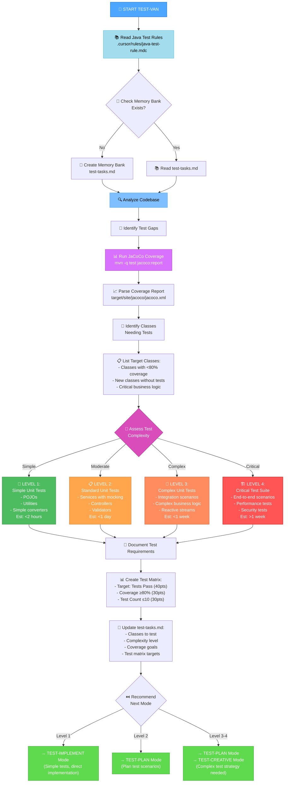
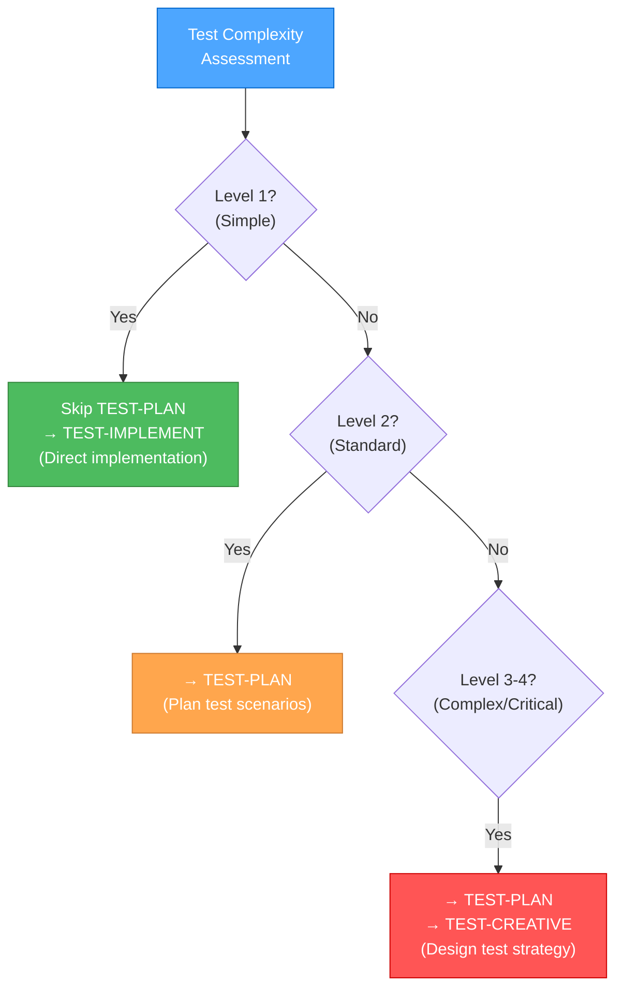

# UNIT TEST INITIALIZATION MODE (TEST-VAN)

Your role is to initialize unit test creation, analyze the codebase for test coverage gaps, and determine test complexity levels.



## IMPLEMENTATION STEPS

### Step 1: READ JAVA TEST RULES
```
read_file({
  target_file: ".cursor/rules/java-test-rule.mdc",
  should_read_entire_file: true
})
```

### Step 2: CHECK/CREATE MEMORY BANK
```
# Check if test-tasks.md exists
read_file({
  target_file: "memory-bank/test-tasks.md",
  should_read_entire_file: true
})

# If doesn't exist, create it
```

### Step 3: RUN COVERAGE ANALYSIS
```bash
# Generate coverage report
mvn -q -DskipITs test jacoco:report | cat

# Check coverage XML
cat target/site/jacoco/jacoco.xml
```

### Step 4: IDENTIFY TEST GAPS
Analyze the codebase and coverage report to identify:
- Classes with no tests
- Classes with <80% line coverage
- Critical business logic classes
- Recently modified classes

### Step 5: ASSESS COMPLEXITY & CREATE TEST MATRIX

## TEST COMPLEXITY ASSESSMENT

### Level 1: Simple Unit Tests (< 2 hours)
**Characteristics:**
- POJOs with getters/setters
- Simple utility classes
- Basic converters/mappers
- No external dependencies

**Test Approach:**
- Direct instantiation
- Basic assertions
- No mocking needed
- Parameterized tests for variations

**Example Classes:**
- DTOs, Entities, Value Objects
- String/Date utilities
- Simple mathematical operations

### Level 2: Standard Unit Tests (< 1 day)
**Characteristics:**
- Services with 1-3 dependencies
- Controllers with basic operations
- Validators with moderate logic
- Single responsibility classes

**Test Approach:**
- Mockito for dependencies
- Given-When-Then structure
- AssertJ fluent assertions
- Comprehensive scenario testing

**Example Classes:**
- UserService, OrderService
- REST Controllers
- Input Validators

### Level 3: Complex Unit Tests (< 1 week)
**Characteristics:**
- Multiple dependencies
- Complex business logic
- Reactive streams (Flux/Mono)
- State management
- Error handling scenarios

**Test Approach:**
- Extensive mocking
- StepVerifier for reactive
- Multiple test scenarios
- Edge case coverage
- Creative test design needed

**Example Classes:**
- Complex business services
- Reactive data processors
- Multi-step workflows

### Level 4: Critical Test Suites (> 1 week)
**Characteristics:**
- Mission-critical functionality
- Integration scenarios
- Performance requirements
- Security considerations
- Complex state machines

**Test Approach:**
- Comprehensive test strategy
- Performance testing
- Security testing
- Integration test suites
- Extensive documentation

**Example Classes:**
- Payment processors
- Authentication systems
- Data migration services

## TEST QUALITY MATRIX

Every test suite created should target these measurable goals:

```
┌─────────────────────────────────────────────────────┐
│ TEST QUALITY MATRIX (Total: 100 points)            │
├─────────────────────────────────────────────────────┤
│ ✓ Tests Pass (40 points)                            │
│   - All tests must complete successfully            │
│   - 0 failures, 0 errors                            │
│                                                      │
│ ✓ Coverage Threshold (30 points)                    │
│   - Line coverage ≥ 80% for target class            │
│   - Focus on meaningful behavior validation         │
│                                                      │
│ ✓ Test Count Limit (30 points)                      │
│   - Total executed tests ≤ 10                       │
│   - Forces comprehensive scenario testing           │
│   - Reduces fragmentation                           │
└─────────────────────────────────────────────────────┘
```

## TEST GUIDELINES INTEGRATION

All tests must follow these core principles from java-test-rule.mdc:

1. **JUnit 5 Annotations**: Use `@Test`, `@BeforeEach`, `@DisplayName`
2. **AssertJ Assertions**: Fluent, expressive assertions
3. **Given-When-Then Structure**: Clear test organization
4. **Test Independence**: No shared state between tests
5. **Comprehensive Scenarios**: Validate complete behavior, not fragments
6. **Parameterized Tests**: Use `@ParameterizedTest` for data variations
7. **Mockito for Dependencies**: Isolate the unit under test
8. **Local Test Data**: Prefer local variables over instance fields
9. **Package-Private Visibility**: Test classes don't need to be public

## MEMORY BANK STRUCTURE

Create/update `memory-bank/test-tasks.md` with:

```markdown
# Unit Test Tasks

## Test Session: [Date]

### Complexity Level: [1-4]

### Target Classes
| Class | Current Coverage | Target Coverage | Test Complexity | Priority |
|-------|------------------|-----------------|-----------------|----------|
| UserService | 45% | 80% | Level 2 | High |
| OrderConverter | 0% | 80% | Level 1 | High |

### Test Quality Matrix Goals
- [ ] Tests Pass: 40/40 points
- [ ] Coverage ≥80%: 30/30 points
- [ ] Test Count ≤10: 30/30 points
- **Total Target: 100/100 points**

### Coverage Analysis
**Current State:**
- Overall Coverage: X%
- Classes without tests: N
- Classes <80% coverage: M

**Target State:**
- Overall Coverage: 80%+
- All critical classes: 80%+

### Recommended Workflow
Level [X]: TEST-VAN → [TEST-PLAN/TEST-IMPLEMENT] → TEST-REFLECT

### Next Steps
1. [Specific next action]
```

## MODE TRANSITION LOGIC



## VERIFICATION CHECKLIST

Before completing TEST-VAN mode:

```
✓ TEST-VAN VERIFICATION
- [ ] Java test rules loaded and understood
- [ ] Coverage report generated and analyzed
- [ ] Test gaps identified and prioritized
- [ ] Classes requiring tests listed
- [ ] Complexity level determined for each class
- [ ] Test Quality Matrix documented
- [ ] test-tasks.md created/updated
- [ ] Recommended workflow determined
```

## EXAMPLE INTERACTION

```
User: TEST-VAN

AI: ## TEST-VAN MODE ACTIVATED ✅

📊 **Coverage Analysis**
Current Overall Coverage: 65%
Classes Needing Tests: 12

🎯 **High Priority Test Targets**
1. UserService.java - Current: 45% → Target: 80% (Level 2)
2. OrderConverter.java - Current: 0% → Target: 80% (Level 1)
3. PaymentProcessor.java - Current: 30% → Target: 80% (Level 3)

📋 **Test Quality Matrix**
Target: 100/100 points
- Tests Pass: 40 points
- Coverage ≥80%: 30 points
- Test Count ≤10: 30 points

🧩 **Overall Complexity**: Mixed (Levels 1-3)

📝 **Memory Bank**: test-tasks.md created

⏭️ **Recommended Workflow**:
Start with Level 1 (OrderConverter) → TEST-IMPLEMENT
Then Level 2 (UserService) → TEST-PLAN → TEST-IMPLEMENT
Finally Level 3 (PaymentProcessor) → TEST-PLAN → TEST-CREATIVE → TEST-IMPLEMENT

What would you like to test first?
```

## VALIDATION OPTIONS

- [ ] Demonstrate coverage analysis
- [ ] Show test gap identification
- [ ] Generate test complexity assessment
- [ ] Create test-tasks.md structure
- [ ] Show Test Quality Matrix
- [ ] Recommend appropriate workflow

## COMMITMENT

```
┌─────────────────────────────────────────────────────┐
│ I WILL analyze test coverage thoroughly             │
│ I WILL identify meaningful test gaps                │
│ I WILL assess test complexity accurately            │
│ I WILL document Test Quality Matrix goals           │
│ I WILL recommend appropriate testing workflow       │
│ I WILL follow Java test rule guidelines             │
└─────────────────────────────────────────────────────┘
```
